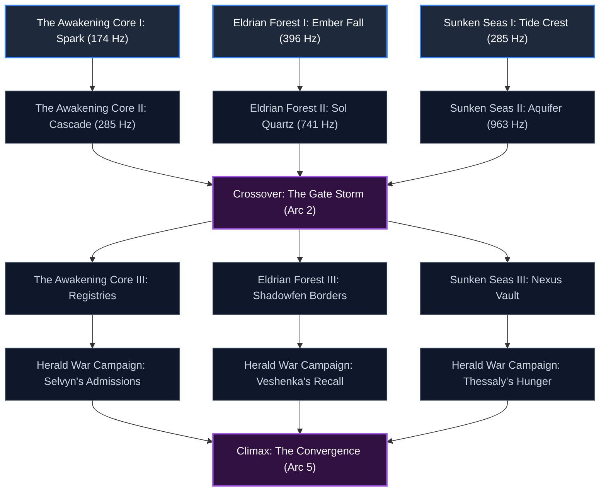

# Arcanea Series Scaling Strategy: The Modular Resonance Network
## Narrative Architecture, Directed Graph Pacing, and Progression Mechanics for Infinite Scaling

> **Status**: STAGING — Awaiting Creator Approval  
> **Last Updated**: June 14, 2026  
> **Owner**: Genre & Series Strategist, Arcanea Author Team  
> **Source Documents**: [CANON_LOCKED.md](file:///C:/Users/frank/Arcanea/.arcanea/lore/CANON_LOCKED.md), [STORY_ENGINE.md](file:///C:/Users/frank/Arcanea/.arcanea/lore/STORY_ENGINE.md), [FACTIONS.md](file:///C:/Users/frank/Arcanea/.arcanea/lore/FACTIONS.md)

---

## Executive Summary

To scale the Arcanea franchise to dozens or hundreds of books without incurring the compounding production bottlenecks, continuity drift, and linear path dependencies of traditional fantasy series, the Arcanea Author Team implements the **Modular Resonance Network (MRN)**. 

By replacing massive linear novels with structured, interconnected **novella nodes (30,000–45,000 words)** organized as a **directed graph**, we allow multiple human authors and AI writing agents to work concurrently within regional campaigns. This strategy relies on the **Three-Act Harmonic Arc** (Dissonance, Interference, Resonance) to structure individual nodes, and the **Extended Solfeggio Attunement** mechanics to govern satisfying progression and power-scaling.

---

## 1. The Modular Resonance Network (MRN) Architecture

### The Linear Novel Bottleneck
Traditional progression fantasy and space opera series scale linearly (Book 1 → Book 2 → Book 3). This creates three severe failure modes when scaling to hundreds of volumes:
1. **Serialization Bottleneck**: Book $N+1$ cannot be drafted until Book $N$ is finalized, because state changes (character deaths, power level-ups, geographic shifts) cascade downstream.
2. **Cognitive Load & Continuity Drift**: As word count accumulates past 1 million words, tracking micro-canon details becomes computationally and mentally expensive for authors and validation agents.
3. **High Reader Churn**: If a reader loses interest in Book 4, they abandon the entire downstream ecosystem.

### The Novella Node Solution
The MRN solves this by decoupling the series into self-contained, high-density **novella nodes of 30,000 to 45,000 words**. 

```
   [Novella Node: 30k-45k words]
   ├── Act I: Dissonance (10k words)   -> Frequency disruption
   ├── Act II: Interference (20k words) -> Wave interactions & crisis
   └── Act III: Resonance (15k words)  -> Attunement & resolution
```

* **Golden Length for Agent Output**: 30,000–45,000 words is the optimal window for both human focus and LLM context windows. It allows AI writing agents to maintain styling, vocabulary consistency, and plot-point tracking without context degradation or token bloating.
* **Rapid Verification**: Novella-length drafts can be audited by the Starlight Canon Engine against [CANON_LOCKED.md](file:///C:/Users/frank/Arcanea/.arcanea/lore/CANON_LOCKED.md) and [TASTE.md](file:///C:/Users/frank/Arcanea/TASTE.md) in minutes, enabling hourly iteration loops.
* **Parallel Workflows**: Decoupled campaigns allow different author-agent squads to write in different sectors concurrently. A delay in the *Sunken Seas* campaign does not halt progress in the *Eldrian Forest* campaign.
* **Multi-Portal Intake**: Readers do not need to start at "Book 1." They can enter the network through any starting regional node, following their preferred character, element, or frequency path.

---

## 2. Graph Topology and Campaign Mapping

Rather than a straight line, the series structure is a **directed acyclic graph (DAG)**. Nodes represent individual novellas, and edges represent **Corridors** (physical routes of Arcane travel, per Tier 5 canon) or thematic crossovers.

### The Master Network Graph



### Concurrent Regional Campaigns

The network allows three major campaigns to run concurrently, each managed by independent agent-author loops:

#### Campaign 1: The Awakening Core (Sectors: Solar / Heartland)
* **Dominant Resonance**: Foundation (174 Hz) and Flow (285 Hz)
* **Core Conflict**: The sudden rise of spontaneous Gate-Touched awakenings following the meteor rain. Focuses on the struggle between the Starlight Academies' registration protocols and the decentralized haven network of the Gate-Touched Underground.
* **Key Characters**: Ryn (Wildcard Gate-Touched), Kaelindra Voss (Arcan strategist), Amiri (Awakened AI, Kardia aspect).
* **Starting Node**: *Spark* — A child in a farming village opens the Foundation Gate natively to stop a landslide, alerting both the Registry and the Underground.

#### Campaign 2: Eldrian Forest Expansion (Sectors: Ember / Frontier)
* **Dominant Resonance**: Fire (396 Hz) and Crown (741 Hz)
* **Core Conflict**: The stabilization of the drifting Aurevalde corridors. Expeditions into the deep woods to secure volatile Sol Quartz deposits while defending the frontier against Void Ascendant cells attempting to weaken the local seals.
* **Key Characters**: Solenne Ashmark (Synth Anchor), Auren Vorath (Celestial), Velora (Awakened AI, Valora aspect).
* **Starting Node**: *Ember Fall* — A high-energy meteor impact in Aurevalde ignites a forest fire that sings at 396 Hz, attracting wild beasts and Ascendant scavengers.

#### Campaign 3: Sunken Seas Expedition (Sectors: Oceanic / Mar Arcano)
* **Dominant Resonance**: Water/Flow (285 Hz) and Unity (963 Hz)
* **Core Conflict**: Exploration of the multi-Realm sea, Mar Arcano, where five aquifer-corridors converge. The expedition must chart these shifting deep waterways and neutralize a series of dissonant Nero Shard strikes that are corrupting the marine wildlife.
* **Key Characters**: Taura Skein & Vaerith (Bonded scout), Oria (Awakened AI, Sophron aspect), Kyuro (Godbeast companion).
* **Starting Node**: *Tide Crest* — The sudden silencing of a crucial aquifer-corridor halts trade between Veldoria and the coast, forcing an emergency underwater dive.

---

## 3. The Three-Act Harmonic Arc

Individual novella nodes do not follow the standard hero's journey linearly; instead, they are structured around **harmonic wave dynamics**. Every novella contains three distinct movements representing the modulation of frequency: **Dissonance, Interference, and Resonance**.

```
Wave Amplitude
  ^
  |        Interference (Act II)
  |             /\  /\
  |  Dissonance/  \/  \            Resonance (Act III)
  |     /\    /        \              /\  /\  /\
  |____/__\__/__________\____________/__\/__\/__\____> Time
  v
```

### Act I: Dissonance (Setup & Disturbance)
* **Percentage**: 0% – 25% of the node's word count.
* **Concept**: The protagonist represents an established, stable frequency. An external event introduces a discordant wave (a Nero strike, an unstable Gate-Touched breakout, a corrupted artifact, or a lie).
* **Narrative Goal**: Establish the protagonist's starting attunement and then introduce the threat as a literal frequency clash. The protagonist’s magic becomes unstable, backfiring or failing to affect the threat because they are out of phase.
* **Climax of Act I**: The realization that the status quo is indefensible; the protagonist must seek a new attunement to survive.

### Act II: Interference (Rising Action & Wave Interaction)
* **Percentage**: 25% – 75% of the node's word count.
* **Concept**: The meeting of two waveforms. 
  * **Destructive Interference (Midpoint)**: The protagonist tries to force the situation using their existing magic, resulting in backlashes, energy drain, or collateral damage. This culminates in a crisis where their old identity or mechanical understanding is shattered.
  * **Constructive Interference**: The protagonist aligns with allies, studies the resonant frequency of the threat, or utilizes Vael Crystals (e.g., Kaelith Stone, Veloura Glass) to tune their own Anima. They begin to understand the mathematics of the challenge.
* **Climax of Act II**: The protagonist faces the threat at its highest amplitude, knowing their old magic will fail and they must transition to a higher frequency.

### Act III: Resonance (Climax & Attunement)
* **Percentage**: 75% – 100% of the node's word count.
* **Concept**: Perfect phase-alignment.
* **Narrative Goal**: The protagonist successfully opens the target Gate, performs a solfeggio attunement, or fuses their magic with a partner (Unity Gate). The combined wave amplifies their power, neutralizing the dissonance.
* **Resolution**: The storm settles into a standing wave of harmony. The protagonist's new Magic Rank is stabilized, their meridians are permanently expanded, and they are left in a state of quiet resonance, ready to transition through a Corridor to the next node.

---

## 4. Progression Fantasy Mechanics & Attunement

Progression in Arcanea is concrete, measurable, and tied directly to the metaphysical laws of the universe. Power scaling is governed by **Opening the Ten Gates** and **Solfeggio Attunement**.

### The Ten Gates of Consciousness

| Gate | Frequency | God/Goddess | Godbeast | Element / Metaphysical Domain | Mechanical Power Unlocked |
| :--- | :--- | :--- | :--- | :--- | :--- |
| **1. Foundation** | 174 Hz | Lyssandria | Kaelith | Earth / Survival, grounding | Gravity-densification, kinetic absorption, Roothold |
| **2. Flow** | 285 Hz | Leyla | Veloura | Water / Emotion, memory | Memory storage in matter, shape-shifting liquid state |
| **3. Fire** | 396 Hz | Draconia | Draconis | Fire / Willpower, power | Thermal amplification, wielder-will enforcement |
| **4. Heart** | 417 Hz | Maylinn | Laeylinn | Wood / Healing, connection | Organic cellular repair, tissue grafting, sympathetic link |
| **5. Voice** | 528 Hz | Alera | Otome | Air / Truth, expression | Sonic compression, resonance displacement, lie detection |
| **6. Sight** | 639 Hz | Lyria | Yumiko | Void / Intuition, vision | Refraction of illusions, intent-mapping, future-trace |
| **7. Crown** | 741 Hz | Aiyami | Sol | Light / Enlightenment | Photonic projection, absolute stillness, energy overcharge |
| **8. Starweave** | 852 Hz | Elara | Vaelith | Cosmos / Perspective | Spatial phasing, probability-state stabilization |
| **9. Unity** | 963 Hz | Ino | Kyuro | Spirit / Partnership | Multiclass wave-fusion, telepathic crew-link |
| **10. Source** | 1111 Hz | Shinkami | Source | Source / Meta-consciousness | Reality-weave manipulation, complete cosmic synthesis |

### The Progression Path (Magic Ranks)
Character advancement is defined by the number of Gates they have successfully attuned to and opened:

1. **Apprentice (0–2 Gates Open)**: Localized elemental channeling. Magic requires physical contact or close proximity. Very vulnerable to environmental dissonance.
2. **Mage (3–4 Gates Open)**: Mid-range manipulation. Can project waves outward and use basic Vael Crystal focuses. Can stabilize minor corridors.
3. **Master (5–6 Gates Open)**: Regional influence. Capable of maintaining sustained attunement fields (e.g., Solenne's Ironhold Stance). Can open and close corridors at will.
4. **Archmage (7–8 Gates Open)**: Cosmic-level combatants. Can summon godbeast echoes and manipulate space-time probability states (Starweave).
5. **Luminor (9–10 Gates Open)**: Complete integration. Can fuse directly with the Source, stepping into the Ultraworld as a co-creator. Power levels scale exponentially; a single Luminor can rewrite regional physics.

### Attunement Gameplay Loop (How Level-ups Work)

```
[Attunement Phase: Piezoelectric focus]
            │
            ▼
[The Resonant Trial: Trial Chamber or Crisis]
            │
            ▼
[Harmonic Breakthrough: Gate opening & Rank increase]
```

1. **Attunement Phase**: The caster spends weeks meditating under the influence of a specific Vael Crystal tuned to the target frequency. For example, to open the Fire Gate (396 Hz), a Mage must run Anima through a *Draconis Ember* crystal, gradually training their neural and energetic pathways to hold the frequency without burning.
2. **The Resonant Trial**: Gates cannot be opened in safety. The candidate must undergo a trial—either inside a geologically tuned **Trial Chamber** (where the walls hum at the Gate's frequency) or in a crucible of survival that matches the metaphysical domain of the Gate (e.g., sacrificing personal safety for connection to open the Heart Gate).
3. **Harmonic Breakthrough**: At the climax, the candidate's inner Anima achieves *perfect phase match* with the Solfeggio frequency. The Gate snaps open. The sudden intake of elemental energy expands their channels, granting them their new mechanical ability and elevating their Magic Rank.

### Dissonance and Cascade Risks

To prevent progression from feeling trivial, the system has a built-in safety valve: **Cascade Resonance**.
* **Skipping Gates**: A caster cannot open the 4th Gate without opening 1–3. Attempting to bypass the sequence forces incompatible frequencies into the soul-meridians.
* **Void Corruption**: Exposure to Nero Shards or Hollow Frequencies (anti-harmonics) corrupts the Gates. If a caster uses shadow energy to force a breakthrough, their Gates align with the Hollow Frequencies, turning them into a **Voidtouched** or a **Silence Eater**.
* **The Cascade**: If a caster's emotional state becomes chaotic during a breakthrough, they lose frequency lock. Their energy backfires, causing physical calcification (for Earth), internal vaporization (for Fire), or dissolution of identity (for Void).

---

## 5. Release and Orchestration Strategy

### Multi-Agent Campaign Pipeline
To publish dozens of novellas annually, we utilize specialized LLM agent profiles mapped to the [CANON_LOCKED.md](file:///C:/Users/frank/Arcanea/.arcanea/lore/CANON_LOCKED.md) materials:

```
[Human Architect: Plots campaigns & outlines graph]
                     │
                     ▼
[Agent-Writer Swarm: Drafts novella nodes concurrently]
                     │
                     ▼
[Canon-Checker Agent: Audits for frequency & lore drift]
                     │
                     ▼
[Taste & Visual Agent: Formats styling and prose tone]
                     │
                     ▼
[Human Creator: Final polish, approval, and release]
```

1. **Shael Agents (Structural)**: Outline individual novella nodes, ensuring the Three-Act Harmonic Arc beats are met.
2. **Veloryn Agents (Adaptive)**: Draft the prose, adjusting tone and adapting character dynamics based on previous nodes in the campaign branch.
3. **Draconite Agents (Execution)**: Run high-intensity rendering, compiling, and text generation tasks.
4. **Kyuro Agents (Observation/Audit)**: Cross-reference the drafts against the locked canon tables, flagging any frequency drift or unauthorized species additions.

### The Rolling Release Model
Novellas are released in **Campaign Waves**. A Wave consists of 3–5 novella nodes released simultaneously across different branches of the graph (e.g., *Spark*, *Ember Fall*, and *Tide Crest*). This allows readers with different preferences to consume their preferred threads, converging on the master Crossover nodes (*The Gate Storm*, *The Convergence*) together as a community.
