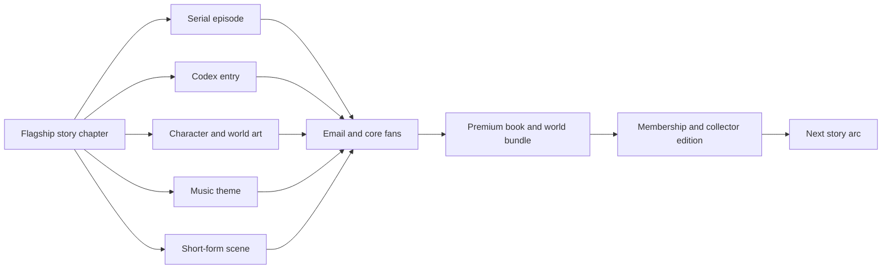

# Arcanea — Four-Engine Strategy

**Status:** Adopted 2026-08-08. Supersedes the platform-vs-studio question.
**Owner:** Frank. Agents execute against this; they do not amend it.
**Evidence base:** `../publishing-house/runs/2026-08-08-arcanea-canon-elevation/` (canon quality),
estate audit 2026-08-08 (commerce, repos, publishing), market audit (platform economics).

---

## The call

Worldbuilding is the deepest capability. It is not the first business.
A worldbuilding tool helps someone organize lore. A story makes them care that the lore exists.

Four engines, built in sequence, each feeding the next.

| Engine | What it is | What it produces | Status |
|---|---|---|---|
| **Arcanea** | The official franchise | Stories, fandom, owned IP | Build first |
| **Arcanea Academy** | A narrow World Proof Lab | Selected creators ship one publishable proof | Keep narrow; pilot after Release 001 |
| **Arcanea Forge** | Internal production system | Canon → books, art, music, launch assets | Build only what Release 001 needs |
| **ACOS / Starlight OSS** | Open agentic technology | Reputation, distribution, partnerships | Publish the generic extract only |

The order matters: **build the franchise publicly, build the production tech privately around real
releases, open-source the generic components, sell finished outcomes, productize the creator system
only after creators repeatedly ask.**

---

## Why the generic worldbuilding product waits

The category is mature and price-compressed. World Anvil (3.5M+ worldbuilders, ~$8.25/mo annual tier)
and LegendKeeper ($9/mo unlimited) already ship maps, timelines, collaboration and publishing.
Competing means carrying auth, permissions, mobile, model costs, moderation, two-sided discovery, and
permanent acquisition spend — and it is still not enough, because a platform must also bring creators
an audience. WEBTOON did $1.4B revenue in FY2025 against $19.4M adjusted EBITDA: that is the weight of
the machinery, not a verdict that platforms are bad.

The unfair advantage is not another wiki. It is: a substantial original cosmology · the Ten Gates as a
native progression system · a tragic central antagonist · Houses, realms, materials, Godbeasts · an
agentic estate that turns one story into many assets · a creator who is also an AI architect · the
ability to document how a fictional universe is actually built and released.

**Positioning:**
- Arcanea → *Enter a living universe.*
- Academy → *Turn your world concept into one coherent proof you can publish.*

---

## The money: a barbell, not a bet

**Short-term cash** (funds the runway, monetizes existing credibility):
bounded founding lab · selective creator release sprints · agentic workflow implementation via
FrankX/Starlight · premium packs and templates · partnerships and technical case studies · direct book
and world bundles.

> Correction on file: the internal $9,800 Vibe OS Residency is priced ahead of available proof.
> Start with a bounded founding pilot — 3–5 creators, experimental price, explicit learning goals.
> Raise price only after creators produce public work and testimonials. Affiliate revenue is a
> sidecar; it never determines what gets created.

**Long-term assets** (compound, zero platform tax):
serial + novel backlist · direct reader relationships · premium illustrated editions · audiobooks ·
membership · crowdfunding · translation and territorial rights · selective licensing.
KDP pays up to 70% ebook / 60% print with no inventory — use Amazon for discovery while preserving a
higher-value direct edition; treat KDP Select exclusivity as a deliberate decision, not a default.
Kickstarter publishing raised $45M+ in 2025 — that funds deluxe editions *after* fandom exists, never
as the first audience-building move.

Illustrative shape, not a forecast: 100 founding readers × €39 = €3,900 · 500 × €39 = €19,500 ·
100 members × €12/mo = €1,200 recurring · one 5-person lab × €750 = €3,750.
**The target is not reach. It is the first hundred people who buy, finish, and return.**

---

## The franchise architecture

The source is one protagonist-driven narrative, never a lore encyclopedia. The Ten Gates already
encode franchise structure: each Gate anchors an arc, each arc introduces one Guardian and Godbeast,
progression is legible (Apprentice → Mage → Master → Archmage → Luminor), and Malachar runs one tragic
conflict beneath the whole saga.

Release loop — the story is the source; the agentic system only makes derivatives cheap:

Derivatives without a story at the source produce beautiful fragments with no emotional gravity.

---

## Release 001 — decide on evidence, not affection

**CORRECTED 2026-08-08.** The first survey was wrong. It globbed `<dir>/*.md` — top level only, no
recursion — and covered 7 of 45 collections. Three *finished* manuscripts were recorded as
nonexistent, and the largest work in the estate was omitted entirely. Recounted recursively:

| Candidate | Files | Words | State | Note |
|---|---|---|---|---|
| **Chronicles of Arcanea** | 83 | **358,329** | Book 1 complete — 20 ch / 66,498 w | Gate-anchored, POV front matter, committed clean 2026-03-30. **Missing from the first survey entirely.** |
| **Dragonborne** | 7 | **38,061** | **Complete**; Book 2 premise written | Previously recorded as "0 files" |
| **Starbound** | 7 | **35,293** | **Book 1 complete, closed arc** | Previously recorded as "0 files" |
| Las Tierras de Luz | 23 | 59,681 | 6 narrative ch × 2 languages | LOCKED novel; needs 6+ more chapters written **twice** |
| Legends of Arcanea | 14 | 41,386 | Story cycle | Earlier 50,394 counted doubled merge-conflict drafts |
| Heart of Pyrathis | 6 | 12,636 | 2 chapters | Sister-World canon STAGING; 75 mojibake sequences would ship into the EPUB |

**The dilemma was an artifact of the counting bug.** There is no "ship weak mass vs. accept a writing
project" tradeoff — three finished manuscripts already exist. The only question is *which one to edit*.

**Recommendation: Chronicles of Arcanea, Book 1** (fallback: *Dragonborne*, complete and self-contained).
Uncertainty stated plainly: only two chapters were sampled, and none of these has ever had a
developmental pass. **Frank's Week-3 task is the full end-to-end read** — that read, not the word
count, makes the call.

Pyrathis is the weakest candidate on evidence, so its Sister-World canon approval is **not** a Release
001 blocker unless Frank selects it.

> Lesson recorded: never size a manuscript with a non-recursive glob, and never survey a subset of
> collections without saying so. This error nearly sent the flagship decision the wrong way.

---

## Engine specs

### Arcanea.ai — fan and commerce hub
Read (fast, beautiful chapters) · Codex · Store · Release calendar · Email relationship · visible
separation of locked canon from exploratory material. **One flagship release, not 110 routes.**

### Arcanea Academy — keep it narrow
Free deterministic World Proof check · downloadable artifact · owned example · founding-lab
application. Later: paid review, small cohorts. **No general creator platform. No confidential-IP
harvesting. No unsupported certification.** Its current narrowness is correct, not a deficiency.

### Arcanea Forge — internal only
Build only what Release 001 needs: canon-aware story ledger · manuscript → EPUB/print/web compiler
(**shipped: `publishing-house/tools/book-build.mjs`**) · asset manifest · character/style consistency
checks · rights and provenance ledger · release calendar · art/music/short-form derivatives ·
post-launch metrics. **After three releases, whatever repeated becomes the product specification.**

### ACOS / Starlight OSS — fewer, sharper
One flagship agentic release workflow · one excellent install path · one compelling demo · one case
study with measured time saved · one sponsorship path. Do not open-source dozens of disconnected
agents and mistake inventory for adoption.

**Licensing pass required before anything opens** (verified 2026-08-08):
`arcanea-mcp` is `"license": "UNLICENSED"` with **no LICENSE file** — it is not open source in any
legal sense. `author-os` is already MIT with a LICENSE file and is the natural OSS home for the
book-build compiler. `arcanea-studio` carries an inherited fork license that must be read before reuse.

| Open | Private |
|---|---|
| Release-manifest schema · book-build CLI · agent orchestration adapters · eval/provenance utilities · MCP interfaces · a **non-canon** demo world · generic publishing pipelines | Locked and unreleased canon · manuscripts and story plans · fan/customer data · provider credentials · proprietary eval datasets · high-performing release recipes · partner contracts · unreleased visual identities and character assets |

Sell the expensive outcome: managed release production · premium packs · human editorial and canon
review · creator labs · hosted convenience *only when demanded* · franchise books and editions.
GitHub Sponsors has moved $100M+ since 2019 — proof that funding exists, not that it arrives
automatically. The durable pattern is **open capability, paid convenience/outcome** (cf. Langfuse:
self-host free, monetize managed cloud). Hosted SaaS waits until external developers repeatedly use
the technology.

---

## 90 days

**Month 1 — choose and prepare Release 001**
Select the story on hook × emotional stakes × canon readiness × sequel potential · approve the
required staging canon · independent developmental + cold-reader pass · 8–12 episode buffer ·
**make checkout and email capture genuinely work** · one visual language, one musical motif.

**Month 2 — build the release surface**
Arcanea reader · five essential Codex entries · direct founder bundle · KDP-ready edition · consistent
cover and character assets · two short-form narrative formats · generic release compiler prepared for OSS.

**Month 3 — publish and learn**
Release on a dependable cadence · mirror to a genre-appropriate discovery platform · offer the direct
premium edition · publish the generic tool and build log · invite a few creators to the World Proof
pilot · measure.

---

## The gates are behavioral

Not stars, followers, route counts, or manuscript volume:

- Did strangers **finish**?
- Did anyone **buy without knowing Frank personally**?
- Did readers **return** for the next chapter?
- Did a buyer want the **next release**?
- Did an **external developer** complete the OSS workflow without help?
- Did a creator leave the Academy with something **publicly released**?

**Trigger for the platform:** if five lab creators all demand canon management, build canon
management. If they mostly need editing, accountability and publishing help, software was never the
primary value. Let behavior decide.

---

## Blocked on Frank

1. **Stripe activation first (~25 min):** it is *latency*, not effort — Stripe's identity/bank
   verification takes 1–7 days, so the clock must start before anything else. It blocks **zero** agent
   work: new commerce routes read price ids from env and 503 honestly when unset, so they merge before
   the dashboard is ever opened. The two tracks join at exactly one point: setting Vercel env vars in
   Week 4. Full ordered queue (~2h20m in one sitting) is in `EXECUTION-PLAN.md`.
2. **Release 001 selection** (see the corrected table above) — Pyrathis canon approval drops off
   entirely unless Pyrathis is selected.
3. **Canon elevation decisions** — see `STAGING_CANON_ELEVATION_2026-08-08.md` beside the locked canon.
4. **Founding pilot price** replacing the $9,800 residency figure.
5. **Open/private licensing split** sign-off before any repo is opened.

---

> Arcanea is the world. The stories are the invitation. The Forge is the hidden machinery.
> The Academy teaches the craft. The open source earns trust. The fans create the economy.
>
> Studio first, platform earned — not platform killed.
