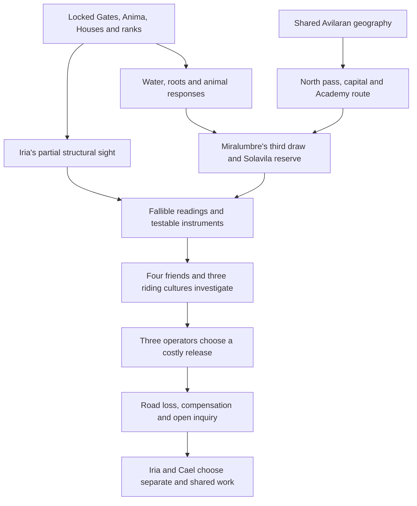

# The Bell Roads · story system and editorial contract

Status: working architecture for **The Borrowed River**, 26 September 2026. This is a decision tool, not newly locked lore. Authority flows from `.arcanea/lore/CANON_LOCKED.md` (cosmic rules) to the shared Avilara dossier and destello notes in `book/las-tierras-de-luz/` (setting and local usage), then to `WORLD_ATLAS.md` (this story's proposals), `PRODUCTION_BIBLE.md` (character/plot promises), and the four public manuscript movements. If two levels conflict, revise the lower one or mark a proposed canon decision for the creator. Do not silently edit the locked sources.

## Core invention and title

**Series: The Bell Roads. Book/movement: The Borrowed River.** The bells are working warning systems connecting city lifts, pass stations, Solavila's reserve, the Academy stable and the Oriván vault. The river is “borrowed” in a literal disputed allocation: Elvia signed the third draw, Miralumbre depended on it, the upper farms paid a cost, and Solavila extended an unsustainable reserve schedule. The later eastern watershed is geographically separate; a similar governance failure and a reused instrument design echo the first debt, not the same water. A title must name an active dramatic tension whose meaning deepens by chapter 24. An inability to see one's own destello is shared by people in the separate novel and cannot carry Iria's distinctive arc.

Iria Soreda is a twenty-nine-year-old map designer and trained rider from Miralumbre. Her professional flaw is an urge to complete a convincing picture before all sources have spoken. Her moral choice in chapter 1 is to publish an honest blank. Her later growth is to share the instruments and authority behind a decision, including with people who can refuse her. She can be loved and still leave on a route of her own. Cael Rovan makes useful listening instruments and must face their misuse, publish his schematics and accept limits on his control. His work has consequences before romance. Iva, Tami, Luz, Mireya and the local keepers are decision makers, not stages of Iria's validation.

## Dependency graph

The governing edge is **observation → independent check → affected person's authority → irreversible cost**. Never promote a visual coincidence directly to certainty, consent or an easy victory. Each large scene must change both the material system and at least one relationship. If spectacle can be cut without changing a later choice, it has not earned its space.

## Clue provenance and fair play

| Introduction | Observation and possible mistake | Later independent check | Remaining question |
| --- | --- | --- | --- |
| Ch 1, Miralumbre | The lift bell sounds twice; city map lacks a reading. Elvia's chipped tile records the third draw and SOREDA. | Crew finds wet stone behind a dry panel; upper keepers and Solavila schedules must match the old tile. | How long did the “one season” draw continue, and who authorized renewal? |
| Ch 2–4, horse road | Station bell, dry root beds and a washed bridge; Iria mistakes a jaguar's movement for an instruction. | Brío's refusal, Tomás's injury, Mireya's and Beltrán's measurements. | Which failures are weather, maintenance or a planned draw? |
| Ch 7–10, Solavila | Hospitals need reserve power, but tower radiance consumes more. A night schedule threatens wetlands. | Shift logs, river keeper keys, Vyne's recorded revision and two missing pages of northern schedules. | When did the third draw end, and who removed the intervening leaves? |
| Ch 13–15, watershed/high roost | New copper strips pulse near an unlogged conduit and tower. | Iva's water figures, Tami's field map, a fresh clay joint and recovered cut band. | Same design can be copied; who installed and paid for each band? |
| Ch 17–21, sea/river | A moved coastal marker and an eastern bridge instrument resemble the hillside work. | Boat crews' chart, ferryman's sounding, Cael's published design, Ema's impounded device. | The coastal seal differs: linked contract or another actor? |
| Ch 22–24, Bell Below | Comb misses one bearing; copper draw starves a different watershed; old ledger has an unsigned fourth notch. | Oren's gauge, local witness tile rubbing and Varek's contract. Elvia's tile is a comparison of governance, not a linked entry. | Who drew the fourth allocation, who will finance restitution? |

**Continuity correction still required in future writing:** Iria's chapter 10 copy of the current schedule and Vyne's notice of two missing leaves should reach the Solavila inquiry. It does not prove a connection to the eastern contractor. Do not retrofit one omniscient villain because two objects look alike. The present 24 chapters complete a rescue but leave both inquiries and the relationship's future open.

## Character/agency graph

| Person or group | Independent work | Conflict with Iria | Decision that must remain theirs |
| --- | --- | --- | --- |
| Elvia and Mireya | Record the third draw from opposing positions | A loved elder's signature and a keeper's lost households | Testify and disagree without an instant family absolution |
| Iva, Tami, Luz | Measure flow, command upper routes, move people and animals | Their measurements and loyalties challenge Iria's readings | Diversion, flight assessment, evacuation and later postings |
| Brío, Aru, velas | Animal partnership shaped by injury, weather and habitat | Refusal closes Iria's preferred route | Whether to approach, carry or continue, under the rider cultures' care |
| Cael | Instrument craft and restitution for prior structural failure | His models omit water and can enable monopoly | Disclose his design, accept loss of a contract and allow departure |
| Vyne, Ema, Varek, Oren | Run the reserve, crossing, contract and vault | Their duties clash without making any of them a moral symbol | Publish records, face inquiry, signal the convoy, pull the release |
| River households and growers | Live with water allocation and road repair | They can refuse “help” that transfers its cost to them | Consent, compensation and future governance |

The romance begins after the women form a functioning circle. Iria and Cael first respect a distinction each can make in the field, then disagree over an instrument with material consequences. Their attraction does not settle the inquiry. Leaving and returning should be ordinary choices supported by work, not supernatural tests.

## Names, map and image rules

- **Iria Soreda / The Borrowed River / The Bell Roads:** memorable through actions and repeating material, not a list of magical epithets. Keep Solavila and Cerro Luminoso in their established locations. Mar de Aurora borders Solavila; Mar Arcano is a later, distinct practicum sea.
- Use a new invented term only when it makes a process easier to understand or changes what a character can do. A name alone does not make a plant, city or artifact distinctive. Give it a shape, labor, seasonal behavior, price and local disagreement.
- Every illustrated scene should match the manuscript's terrain, costume, animal markings, agency and scale. Existing art contains older visual assumptions; audit chapter plates before claiming a unified visual edition. Do not use Earth place names in in-world labels.
- Preserve the old story URL as a permanent redirect. The public page's title, description, hero and canonical URL must agree. State that the 24 chapters are an **illustrated serial in progress**, not a complete novel.

## Honest quality gates and remaining work

1. **Foundation pass:** no new Gate or Godbeast, no Luminor rank below nine Gates, no person-traversable aquifer. The novel's Selene, Mercedes, Renata and Iolen remain separate from this story.
2. **Causality pass:** map each clue to its observer, independent check and later payoff; account for elapsed days, who has a tile, how messages travel and where each animal rests.
3. **Scene pass:** every choice has another plausible option, a cost and a consequence. Give the opposition specific needs and practices; let humor, food and ordinary skill survive danger.
4. **Prose pass:** remove thesis sentences that explain the reader's feeling; dramatize through gesture, measured disagreement and varied sentence rhythm. A chapter ending must alter the next chapter's available actions.
5. **Visual pass:** commission and review a coherent geography plate, Solavila street/market scene, rider-circle group and Oriván machinery; reconcile legacy imagery with new opening and city architecture.
6. **Release pass:** read all 24 chapters sequentially on mobile and desktop, validate anchors and images, test old redirect and live URL. A successful build certifies a functioning site; it cannot certify cinematic or literary excellence. The current work is an improved foundation and opening, with a full-book literary and illustration pass still owed.
