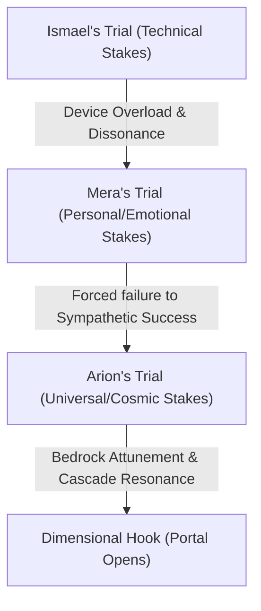

# Chapter 7 Narrative Strategy: The Entrance Trials

This document plans the structure, pacing, and progression fantasy mechanics for **Chapter 7: The Entrance Trials** of *Book One: The Gate of Foundation*. 

---

## 1. Chapter Structure: The Three-Act Harmonic Arc

The chapter is organized under the Three-Act Harmonic Arc framework, mapping narrative progression to wave-dynamics (Dissonance, Interference, Resonance).

### Act I: Dissonance (0% – 25%)
* **Focus**: Setup, sensory overload, and frequency mismatch.
* **Narrative Beats**:
  * **The Intake Atmosphere**: Arion, Mera, and Ismael stand in the clinical, high-stone testing chambers of the Academy of Creation & Light. The ambient sound is a dense hum of standard training crystals.
  * **The Conflict**: The Academy's testing apparatus is designed for structured, bloodline-attuned magic. Our protagonists' abilities do not fit this rigid grid.
  * **The Dissonance**:
    * **Ismael**: The wardens view his mechanical "wheel" tool-belt as a crutch, lacking bloodline purity.
    * **Mera**: Her healing magic is sympathetic, but the testing chamber demands raw, forced manipulation of water volume.
    * **Arion**: The examiners forbid Mamoru from entering the dais, forcing Arion to step up alone while the wolf's presence causes a low, protective growl that vibrates out of phase with the room's silver-white ore.

### Act II: Interference (25% – 75%)
* **Focus**: Waveform collision, failure of old methods, and collaborative adjustment.
* **Destructive Interference (Midpoint - 50%)**:
  * **Ismael's Trial**: Ismael attempts the capacity trial using his device to channel fire-stone energy. The rigid testing crystal (an raw earth/fire stone) overloads the unshielded copper gears of the wheel. The device smokes, energy spikes, and the feedback drains Ismael's Anima. The examiners prepare to fail him.
  * **Mera's Trial**: Mera enters the Aqualis testing pool. She is ordered to force a large volume of water into a suspended sphere. She tries to force it with raw will, causing a destructive backlash that turns the water freezing and turbulent, depleting her strength.
* **Constructive Interference (50% – 75%)**:
  * **Mera's Attunement**: Mera abandons force. She tunes her emotional state to the sympathetic frequency of the city's ancient water canals. By humming a low-frequency healing pitch (a Flow/Water resonance), she listens to the water rather than forcing it. The water responds, rising into a perfectly stable, glassy dome. She passes.
  * **Ismael's Grounding**: Arion uses his Pattern Sight to locate the leaking energy nodes in the room. He signals Ismael to ground the device. Ismael realigns the wheel to the exact 174 Hz (Foundation/Earth) resonance of the limestone floor, absorbing the feedback and turning the destructive energy into a stable loop. He passes, proving synthetic compilation works.

### Act III: Resonance (75% – 100%)
* **Focus**: Attunement, peak amplitude, and the dimensional threshold.
* **Narrative Beats**:
  * **Arion's Trial**: Arion steps onto the central dais. The examiners test his core capacity using a master Vael Crystal (Sol Quartz). 
  * **The Peak**: Arion makes physical contact with the crystal. His Pattern Sight flares. Instead of a localized reaction, his Anima connects with the entire leyline network of the Academy.
  * **Breakthrough**: The frequency locks onto the Foundation Gate (174 Hz). Arion grounds his Anima into the bedrock of the valley. The crystal glows with a blinding silver-white light, but the sheer capacity causes the testing crystal to crack.
  * **The Cascade**: The energy is too vast, threatening to shatter the testing chamber. Arion holds his focus, achieving perfect phase-alignment and snapping open the **Gate of Foundation**. The sudden intake of energy stabilizes the room's physical structure, holding the cracked stone together.
  * **The Hook**: The high-amplitude resonance acts as a dimensional beacon, pairing with a corresponding signal on Earth. A tear of black-and-gold Void energy opens directly above the dais. A binary, digitized hum echoes through the room. Through the rift, the outlines of a modern Earth city (Los Angeles) and a young woman (Emilia Chen) reaching out become visible as the chapter closes.

---

## 2. Dramatic Tension and Trial Escalation

The dramatic tension rises progressively through the three trials, shifting from technical anxiety to survival stakes, and finally to a cosmic event.

| Candidate | Target Gate / Element | Stakes | Dramatic Function |
| :--- | :--- | :--- | :--- |
| **Ismael** | Foundation / Earth (174 Hz) | Expulsion, destruction of his device | Establishes the hostility of the Academy's rigid standards. Highlights the friction between bloodline magic and technomancy. |
| **Mera** | Flow / Water (285 Hz) | Loss of identity, severe Anima drain | Elevates the stakes to personal survival and emotional limits. Demonstrates that alignment beats raw force. |
| **Arion** | Foundation / Earth (174 Hz) | Catastrophic structural collapse, dimensional tear | Pushes the trial to its absolute peak. Introduces the protagonist's unique capacity and sets up the overarching plot. |

---

## 3. Progression Fantasy Mechanics: Foundation Attunement

The mechanics of Arion's breakthrough are defined by the physical laws of Arcanean magic:

1. **Grounding (174 Hz)**: To survive the capacity test, Arion must attune to the base frequency of the Kaelith Stone. By grounding his energy into the bedrock, he gains the ability to absorb kinetic force and stabilize physical structures (Roothold).
2. **Cascade Resonance Risk**: Because Arion's Pattern Sight is open, his attunement is not restricted to the crystal. It sweeps the entire valley's grid. The sudden intake of energy expands his meridians, raising his Magic Rank to **Mage (1 Gate Open)**, but also risks physical calcification if he loses focus.
3. **The Sympathetic Pair**: The portal opens because Arion's 174 Hz breakthrough coordinates with the latent Pattern Sight of Emilia Chen on Earth. The two waveforms lock in phase, creating a sympathetic bridge that rips the dimensional barrier.

---

## 4. Hook for Chapter 8: The Summoning

* **The Event**: The portal does not open cleanly; it tears. The black-and-gold Void energy represents unformed potential (Nero's aspect) clashing with the structured light of the Academy.
* **The Transition**: Chapter 7 ends with the portal spinning, the wardens fleeing, and Arion staring into the rift. Chapter 8 will open with a POV shift to Emilia Chen in her Los Angeles apartment, experiencing the same resonance as her screen glitches into binary patterns before she is pulled through.
