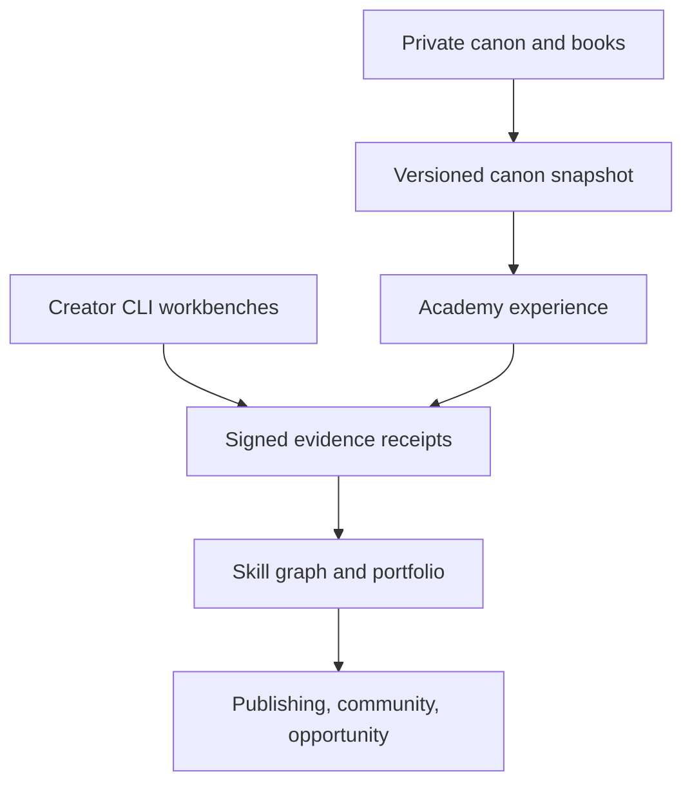

# Arcanea Academy Living System

> **Status:** target architecture; not a claim about the current runtime  
> **Owner:** `frankxai/arcanea-ai-app`  
> **Updated:** 2026-09-01

## Decision

Arcanea Academy is one institutional system expressed through three bounded
planes:

1. **Mythic Academies** — the three fictional institutions authored in the
   books: the Luminary Citadel of Crystalpeak, the Draconis Forge at the
   Caldera of Ignis, and the Abyssal Athenaeum of Thal'Maris.
2. **Living Academy** — the real creator-learning product and Academy routes
   inside `frankxai/arcanea-ai-app`.
3. **Creator workbenches** — CLI and repository-native systems such as
   `frankxai/arcanea-author` that produce work and learning evidence.

The planes share contracts, not mutable copies. Fiction supplies meaning and
canonical entities. The product supplies learning, evaluation, and portfolio
projection. Workbenches supply artifacts and verifiable evidence. No product
experiment, generated image, learner submission, or agent output becomes book
canon without an explicit canon decision in the private source repository.

Product-facing **Arcanea Academy** is the Accord: a real-world umbrella and
portal through which creators can enter the philosophies, places, rituals, and
pedagogies of the three fictional Academies. It does not flatten the three into
one fictional campus or invent a fourth Great Academy.

| Fictional institution | Product projection |
|---|---|
| Luminary Citadel of Crystalpeak | creation, story, light-weaving, diplomacy, and narrative craft |
| Draconis Forge at the Caldera of Ignis | execution, game systems, making, discipline, and release craft |
| Abyssal Athenaeum of Thal'Maris | depth, memory, research, editing, continuity, and transformation |

This mapping is an experience-design proposal. It does not rewrite the books'
seven-year curricula or their faculty.

The browser-local World Proof Lab in `frankxai/arcanea-academy` remains the
Academy's Stage 0 acquisition front door. This document does not widen its
browser-local data boundary or claim that an LMS,
accounts, agents, portfolios, payments, or certifications are live.

## Repository boundaries

| Repository | Authority | Must not become |
|---|---|---|
| `frankxai/arcanea-ai-app` | Private production runtime; Academy routes; books; locked/staging canon; curriculum, progression, faculty, evidence, and portfolio contracts | Disconnected copies with no authority order |
| `frankxai/arcanea-academy` | Thin public World Proof acquisition experience and handoff into the living Academy | The full LMS, a second lore vault, or the Academy control plane |
| `frankxai/arcanea` | One-way public projection of approved canon and open materials | An independently authored authority or learner database |
| `frankxai/arcanea-author` | Author workbench, writing agents, manuscript memory, author-skill progression | The Academy control plane |

Do not create another Academy repository. Add a repository only when a vertical
has an independent release, dependency, privacy, or security boundary.

## Institutional model

The earlier concept collapsed three different responsibilities into
"Guardians." Keep them distinct:

| Layer | Cardinality | Responsibility |
|---|---:|---|
| **The Ten Guardians** | Fixed | Canonical Gate archetypes. They orient the journey and may have strictly versioned teaching projections. They are not a generic faculty roster. |
| **The Luminor Faculty** | Extensible | Authors, editors, narrative designers, artists, game developers, publishers, web builders, audience strategists, licensed guest masters, and disclosed agent teachers. |
| **Forge Crews** | Per project | Working agents that research, draft, build, critique, test, package, and publish artifacts under creator control. |

A canonical character may teach through a `Guardian teaching projection`, but
the projection is an agent version—not the fictional entity itself. A teacher
based on a real person requires owned/licensed material and explicit identity
permission. Otherwise use an attributed method lens or a role-based composite;
never impersonate a living author.

## Learning primitive: proof, not consumption

The Academy does not award progress for watching content. A skill node advances
only when a creator produces an artifact, receives a rubric-versioned review,
and preserves the evidence.

Initial schools:

| School | Example evidence |
|---|---|
| World & canon | world bible, rule matrix, map logic, continuity audit |
| Character & performance | character diamond, voice test, relationship arc, scene performance |
| Story & language | premise, structure, scene, chapter, revision receipt |
| Visual direction | visual DNA, model sheet, environment key, approved asset packet |
| Game & interaction | mechanic, level/quest, narrative system, playable build |
| Editorial & publishing | developmental edit, copy edit, edition files, metadata |
| Audience & launch | positioning, reader promise, campaign artifact, measured release |
| Web & commerce | portfolio, landing experience, funnel, checkout, analytics evidence |

Each node defines prerequisites, observable criteria, accepted artifact types,
rubric version, minimum evidence, evaluator policy, and expiry/revalidation
rules. The Gates may structure the experience, but the underlying professional
skills and evidence remain explicit.

Progress states are evidence states, not watch-time states:

`encountered -> practiced -> demonstrated -> shipped -> taught`

`taught` requires evidence that another creator improved; publishing a lesson
alone is insufficient.

## Creator-owned evidence contract

The creator's repository is the durable workbench. The Academy is a projection
and validation layer, never the sole owner of their portfolio.

```json
{
  "schema": "arcanea.learning_receipt.v1",
  "subject_id": "creator:*",
  "skill_id": "world.canon.continuity.v1",
  "artifact_ref": "git+https://github.com/owner/project@commit#path",
  "artifact_hash": "sha256:*",
  "rubric_id": "arcanea.world-proof.v1",
  "evaluator": { "id": "mentor:*", "version": "*", "human": false },
  "result": { "status": "revise|pass", "score": 0 },
  "canon_ref": { "repository": "frankxai/arcanea-ai-app", "commit": "*" },
  "rights": { "owner": "creator", "visibility": "private|review|public" },
  "created_at": "RFC-3339"
}
```

Receipts are append-only. Later reviews supersede earlier judgments without
rewriting history. Public portfolios resolve only creator-approved artifacts
and disclose whether evaluation was deterministic, agent, peer, or human.

## System flow



### Canon projection

- Publish an immutable, machine-readable canon snapshot from a specific
  `frankxai/arcanea-ai-app` commit. Export approved public material one-way to
  `frankxai/arcanea`.
- Product content stores `entity_id`, `canon_ref`, and canon state; it does not
  paste lore into a second mutable database.
- Production uses locked canon. Staging canon may appear only in visibly
  labeled preview environments.
- Learner worlds remain separate namespaces. Promotion into Arcanea canon is a
  governed editorial act, never an automatic reward.

### Workbench projection

- CLI plugins write artifacts plus local receipts under the creator's project.
- GitHub integration later validates commit, path, hash, rubric, and provenance.
- The Academy projects those receipts into a private skill graph and a
  creator-controlled public portfolio.
- A user can export their graph, receipts, and artifact index without the
  Academy runtime.

### Teacher-agent contract

Every teacher agent declares:

- stable ID, origin class, disclosure, version, and accountable owner;
- allowed knowledge and source/license references;
- curriculum scope, teaching style, tools, and forbidden claims;
- rubric IDs it may apply and whether a second evaluator is required;
- data boundary, memory scope, escalation path, and evaluation history.

Teacher origin classes are `canonical_projection`, `role_composite`,
`public_domain_method`, `licensed_master`, and `creator_owned`. A teacher may
guide and evaluate; it may not silently rewrite a creator's work, certify its
own output, or represent generated lore as canon.

## Content and media substrate

- Markdown/MDX and typed manifests remain the portable authoring source.
- GitHub holds canon, curriculum definitions, rubrics, visual specifications,
  prompts, and receipts—not bulk production binaries.
- Vercel hosts the Next.js experience. Vercel Blob holds private masters and
  immutable approved renditions; Vercel Image serves responsive imagery.
- Supabase becomes the metadata, identity, approval, and projection control
  plane only when Stage 1 requires persistence. It stays out of the render hot
  path.
- Google Drive is for human proof/review packages. Notion is for briefs and
  decisions. Neither is the source of truth for canon, skills, or web binaries.
- Components reference `asset_id` or semantic placement keys, never provider
  URLs.

## Sequence

| Stage | Scope | Exit evidence |
|---|---|---|
| **0 — World Proof** | Current browser-local five-field check and founding-lab application | Verified preview and real creator usage |
| **1 — Portfolio kernel** | `learning_receipt.v1`, GitHub artifact import, private skill graph, portable profile export | Ten creators each preserve and project one reviewed artifact |
| **2 — Faculty kernel** | Three agents: World Architect, Character Director, Publishing Editor; transparent rubrics and independent review | Review agreement, revision uplift, and no unapproved canon drift |
| **3 — Academy loop** | Missions, cohorts, peer review, progress views, creator DAM/CMS integration | Repeat completion and portfolio quality, not lesson consumption |
| **4 — Guild network** | Licensed guest masters, game/design/publishing tracks, opportunity marketplace | Paid demand and governed quality at scale |

Do not build Stage 3 before Stage 1 proves that creators value the evidence and
portfolio kernel. Do not call any layer certification until assessment,
identity, appeals, governance, and legal claims are independently approved.

## Non-negotiables

- One private canon authority, one Academy progression authority, one-way
  public projections, and creator-owned work.
- Mythic language may compress complexity; it may not hide status or evidence.
- Guardian identity, gender/presentation, costume, and Godbeast pairing come
  from approved visual specifications—not names, model priors, or a prompt.
- Every public claim resolves to evidence; every agent judgment identifies its
  rubric and version; every published asset has rights and provenance.
- The portfolio is the product's compounding output. Course completion is not.
