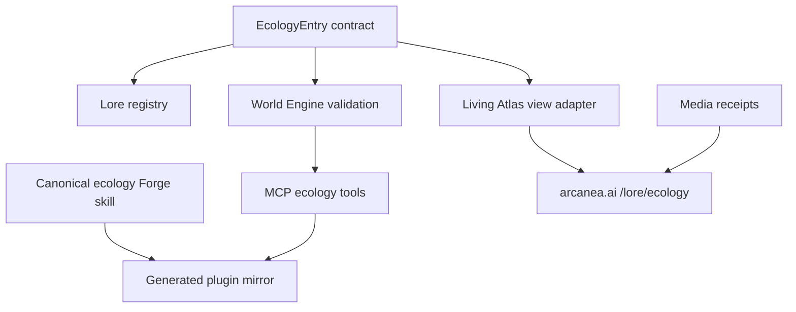

# Arcanea Ecology Architecture

Status: proposal infrastructure. Nothing in this document promotes an organism into locked canon.

## Repository decision

Keep Arcanea ecology in `frankxai/arcanea-ai-app` while the canon contract, website, World Engine, skill, MCP tools, and media receipts evolve together.

The monorepo is the authority:

### Ownership boundaries

| Concern | Canonical location | Rule |
|---|---|---|
| Organism interchange contract | `packages/world-engine/src/ecology/` | Schema, TypeScript types, validators, graph analysis, and APL prompt compiler evolve together. |
| Source and proposal inventory | `.arcanea/lore/ecology/` | Source-attested claims remain separate from proposal mechanics. |
| Reusable authoring workflow | `oss/skills/arcanea/arcanea-ecology-forge/` | This is the only hand-maintained skill source. |
| Plugin distribution | `packages/arcanea-ecology-plugin/` | The packaged skill is generated from the canonical OSS skill; never edited independently. |
| Agent tools | `packages/arcanea-mcp/src/tools/ecology.ts` | Tools plan, validate, analyze, and compile prompts; they do not generate random lore. |
| Website presentation | `apps/web/lib/ecology/` and `apps/web/app/lore/ecology/` | A thin Atlas view adapter consumes the World Engine contract. It is not a second canon schema. |
| Generated imagery | `apps/web/public/images/ecology/` | Optimized delivery assets only. Every file must have a receipt in the media manifest. |
| Provenance and review | `docs/ecology/WAVE_01_MEDIA_MANIFEST.json` | Generation, hashes, rights state, review state, and publication authority travel with each asset. |

## Extraction threshold

Create a separate ecology repository only when at least two of these become true:

1. Ecology ships on an independent release cadence.
2. External contributors need a distinct license or governance model.
3. Multiple products consume the ecology dataset without consuming the Arcanea monorepo.
4. The media corpus needs storage, access control, or delivery infrastructure that materially differs from the website.

Until then, a second repository would create duplicated schemas, provenance drift, and ambiguous canon authority. If extraction happens later, move the contract and registry together and publish a versioned package back to this monorepo; do not fork the data.

## Promotion boundary

- `proposal`: original mechanics, generated visuals, or synthesis not explicitly approved by the Creator.
- `staging`: source-attested material that is still outside the locked canon registry.
- `locked`: requires explicit Creator approval plus a cited approval receipt.
- An entry that combines source-attested traits with proposed mechanics remains a proposal as a whole; its individual source claims retain their provenance.

Wave 01 media is staged and reviewable. It is not authorized as locked canon or production-published media by the presence of a file, URL, score, or generated image.
