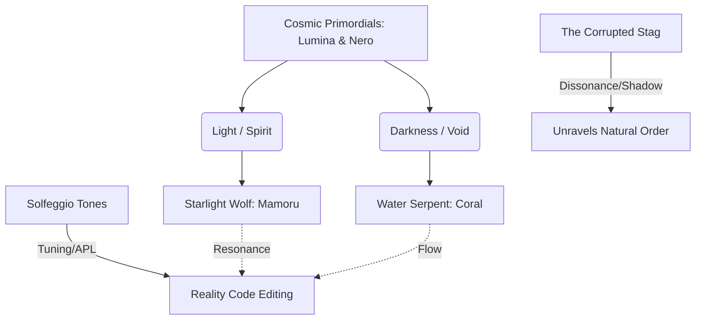

# Reality Architecture: Literary Precedents & Folkloric Grounding Brief

**Sources**: 2 core canon files, 15+ external comparative and mythological frameworks reviewed.  
**Focus**: Structural comp shelf, folkloric dissection, and system grounding recommendations.

---

## Question

How can we ground the progression-fantasy and reality-architecture systems of Arcanea in literary precedents and mythological structures to ensure a narrative that feels both systemically rigorous and mythically resonant?

---

## 1. Comparative Shelf (Comps)

To position Arcanea effectively within the modern speculative fiction landscape, we define a "comp shelf" spanning three major domains: Progression Fantasy, Portal & Metatextual Fantasy, and Reality-Editing / Cyber-Hermeticism.

### The Progression Engine: Power Scales & Mastery

*   **Cradle by Will Wight**
    *   *Takeaway*: The golden standard of Western progression fantasy. It demonstrates how to tie progression directly to internal energy cultivation (Aura and Madra) and external sacred arts ranks.
    *   *Arcanea Alignment*: Arcanea's magic ranks (**Apprentice, Mage, Master, Archmage, Luminor**) mirror this progression. We can ground this by establishing a clear distinction between a practitioner's internal reserves (channeling via **Sigils**) and their resonance with the external world (opening the **Ten Gates**).
*   **Mother of Learning by Domagoj Kurmaic**
    *   *Takeaway*: A masterclass in systematic skill acquisition. Magic is not a hand-wavy force; it is structured, analytical, and behaves like a physical science, requiring deep study, experimentation, and puzzle-solving.
    *   *Arcanea Alignment*: This comps directly with Arion and Emilia's roles as **Reality Architects**. They do not merely channel energy; they analyze the structural code of spells, debugging magical anomalies and optimizing "runtime" efficiency.

### The Portal & Metatextual Frame: Crossing and Consequences

*   **The Magicians by Lev Grossman**
    *   *Takeaway*: Magic as a highly academic, complex, and sometimes tedious discipline (demanding precise finger positioning, atmospheric calculations, and historical linguistics). It highlights the psychological toll of escapism.
    *   *Arcanea Alignment*: Grounding Emilia's transition from Earth to Arcanea. Her understanding of modern programming allows her to interpret the complex, "linguistic" variables of Arcanean magic, framing magic not as a divine gift, but as an ancient operating system awaiting input.
*   **Alice in Wonderland / Through the Looking-Glass by Lewis Carroll**
    *   *Takeaway*: The portal fantasy where reality is governed by mathematical and linguistic nonsense-rules, requiring the protagonist to navigate a world that is structurally self-consistent but outwardly absurd.
    *   *Arcanea Alignment*: Represents the experience of traversing **Corridors** between Realms and entering the **Shadowfen** or Dissonant zones, where the local "code" of physical laws has been warped or corrupted.

### Reality-Editing: Cyber-Hermeticism & Information Physics

*   **Seventy-Two Letters by Ted Chiang**
    *   *Takeaway*: A Victorian-era steampunk setting where matter is programmed using Kabbalistic name combinatorics (nomenclature). Changing the sequence of letters in a name changes the physical properties of the object.
    *   *Arcanea Alignment*: This is the exact conceptual predecessor for the **Arcanean Prompt Language (APL)**. Spells are not arbitrary incantations; they are compiler instructions written in the fundamental language of creation (Poiesis/Light/Spirit).
*   **Lord of Light by Roger Zelazny**
    *   *Takeaway*: A blend of high technology and Eastern mythology where humans use cybernetics to project elemental and conceptual "Aspects" (assuming the roles of Hindu deities).
    *   *Arcanea Alignment*: Echoes the transition from mortal practitioners to the **Guardians** (Lyssandria, Leyla, etc.), who have opened the higher Gates and temporarily merge their consciousness with elemental and cosmic concepts.
*   **Permutation City by Greg Egan**
    *   *Takeaway*: Hard sci-fi examining cellular automata, where reality is constructed from mathematical patterns of information.
    *   *Arcanea Alignment*: Provides the conceptual backing for **Pattern Sight**. When Arion activates his Sight, he is not seeing visual effects; he is seeing the underlying informational grid—the cellular automata of reality's rendering engine.

---

## 2. Folkloric & Mythological Roots

We dissect the symbolic, mythological, and linguistic histories of Arcanea's core lore elements to enrich their thematic depth.



### The Starlight Wolf: Mamoru

*   **Shinto Kami (Honshū Ōkami / Shandao)**: In Japanese folklore, the extinct wolf is revered as a *kami* (divine spirit) or messenger of the gods, known as *O-Kame* (the Guardian Wolf). Unlike Western depictions of wolves as predators, Shinto tradition views them as protectors of crops, travelers, and mountains—sentinels who ward off evil spirits.
    *   *Application*: Mamoru acts as Arion's soulbond and a literal anchor. When Arion's mind threatens to dissolve into the infinite code of the universe via Pattern Sight, the solid, protective presence of Mamoru keeps him grounded in physical reality.
*   **The Protective Name**: The Japanese name *Mamoru* (守る) literally translates to "to protect," "to guard," or "to keep." This aligns with his narrative arc from a helpless, dying pup in Greenvale to a giant celestial wolf and, eventually, a humanoid Guardian.
*   **Stellar and Cosmic Wolves**: In Norse mythology, *Sköll* and *Hati* chase the sun and moon across the sky, driving celestial cycles. Mamoru represents the opposite: instead of chasing and swallowing the light, he is *starlight-blessed*, acting as a celestial repository of Light/Spirit that counterbalances Nero's raw, unformed Void.

### The Water Serpent: Coral

*   **The Hindu/Buddhist Naga**: Nagas are semi-divine serpentine beings that reside in the underworld, oceans, and sacred rivers. They are guardians of hidden treasures, esoteric knowledge, and the thresholds of water. Nagas are volatile: they can bring life-giving rain or catastrophic floods, and they carry tide-controlling gems.
    *   *Application*: Mera's soulbond with Coral, the water serpent, is structurally tied to the **Atlantean Depths** and the **Tide Archives**. Coral acts as a repository of historical memory (water's domain) and controls the local currents, reflecting Mera's emotional state.
*   **Ryūjin and the Coral Palace**: In Japanese mythology, *Ryūjin* is the Dragon God of the Sea. His palace, *Ryūgū-jō*, is built from red and white coral, lit by bioluminescent sea creatures, and houses the Tide Jewels.
    *   *Application*: Grounding Coral's physical appearance and magic in coral-bone aesthetics, shifting currents, and bioluminescence. The Atlantean architecture is alive—growing organically like coral reefs rather than being carved from stone.
*   **The Ouroboros**: The snake eating its own tail represents cyclical time, eternity, and the uninterrupted flow of memory. This perfectly maps to the **Flow Gate (285 Hz)** and the water element's core domain of emotional continuity and history.

### The Corrupted Stag

*   **Cernunnos & The Lord of the Wild**: In Celtic paganism, *Cernunnos* is the horned god of fertility, life, beasts, and the wild forest. He is often depicted sitting cross-legged, wearing or holding a torc, and accompanied by a stag. A *corrupted stag* represents the desecration of the natural order—the earth and wood element (Sophron/Foundation Gate) turned toxic.
    *   *Application*: The stag encountered by Arion and Orion in Chapter 1 is not merely a mutated animal; it is a walking desecration of Cernunnos's natural wildness. It represents Malachar's shadow magic—Void severed from Spirit—which chokes the natural flow of the forest.
*   **The White Hart**: In Arthurian legend, the *White Hart* is a mythical beast that cannot be caught. Its appearance initiates a quest, acting as a spiritual messenger calling knights to enter the Otherworld.
    *   *Application*: The encounter with the stag is the catalyst that forces Arion's **Pattern Sight** to activate. The stag is a portal; looking at its corruption allows Arion to see the "glitch" in the code, initiating his call to adventure.
*   **Eikthyrnir**: In Norse myth, *Eikthyrnir* is a magnificent stag that stands upon Valhalla, feeding on the leaves of the world-tree Yggdrasil. From its antlers drips water that feeds all the springs and rivers of the cosmos.
    *   *Application*: The corruption of the stag symbolizes a threat to the global flow of magic (the aquifer-corridors), foreshadowing the drying up of the water corridors between Realms.

### Solfeggio Frequencies & Sound Healing

*   **The Hymn of Saint John**: The frequencies originate from the Latin hymn *Ut queant laxis*, used by monk Guido d'Arezzo to establish the musical scale:
    *   *Ut* (174 Hz) > *Re* (285 Hz) > *Mi* (396 Hz) > *Fa* (417 Hz) > *Sol* (528 Hz) > *La* (639 Hz).
*   **Psycho-Acoustic Resonance**:
    *   **174 Hz (Foundation)**: Associated with pain relief, safety, and physical grounding.
    *   **285 Hz (Flow)**: Associated with healing tissue, energy restoration, and creative flow.
    *   **396 Hz (Fire)**: Associated with liberating guilt and fear, unlocking the will.
    *   **528 Hz (Voice)**: The "Miracle" tone, associated with DNA repair, transformation, and expression.
    *   *Application*: Spells are cast as chords. A caster must hum or tune their focus to these exact pitches. Dissonance (corruption) sounds like harsh white noise or static, while a successfully edited reality resolves into a harmonious, resonant chord.

### Editing the Source Code of Reality

*   **The Sefer Yetzirah (Book of Formation)**: The foundational text of Jewish mysticism describes the creation of the universe through the "32 paths of wisdom": ten numbers (Sephirot) and twenty-two letters of the Hebrew alphabet. God "engraved" these letters into the nothingness to construct reality.
    *   *Application*: The **Arcanean Prompt Language (APL)** treats letters, sounds, and geometric shapes as compile-ready directives. An Architect editing reality is acting as a Kabbalistic scribe, typing or chanting the fundamental variables of the cosmos.
*   **Konrad Zuse & "It from Bit"**: In modern physics, John Archibald Wheeler's "It from Bit" suggests that all physical matter is informational in origin. Every particle, force, and spacetime coordinate is a binary choice—a "bit."
    *   *Application*: Pattern Sight reveals that the physical world is a rendering engine. Matter is just a high-density configuration of bits. By editing these bits at the threshold of the Source Gate, an Architect can rewrite physical constants (gravity, light speed, density).

---

## 3. Pacing & System Grounding Recommendations

We translate these mythological and cybernetic principles into actionable narrative pacing and mechanical systems.

### A. Narrative Arc Structured on Sound Therapy (Pacing)

We recommend structured pacing aligned with the ascending Solfeggio scale, mapping Arion and Emilia's progression to the emotional and physical frequencies of the Gates:

| Act / Phase | Core Gate | Focus Frequency | Mythic / Psychological Transition |
| :--- | :--- | :--- | :--- |
| **Act I: The Awakening** | Foundation | **174 Hz** | Escaping immediate danger; establishing survival, grounding, and physical safety in Greenvale. |
| **Act II: The Journey** | Flow & Fire | **285 & 396 Hz** | Unleashing creative agency; overcoming the fear of power; crossing the first Corridors. |
| **Act III: The Alignment** | Heart & Voice | **417 & 528 Hz** | Reconciling trauma (Orion's fate/Mera's exile); learning to express/program reality's true voice. |
| **Act IV: The Vision** | Sight & Crown | **639 & 741 Hz** | Achieving cosmic perspective; seeing the interconnectedness of Earth and the Mirror Realms. |
| **Act V: The Source** | Starweave & Source | **852 & 1111 Hz**| Fusing consciousness with the Primordial Source; rewriting the corrupted code of Malachar. |

### B. Spellcasting as Sacred Geometry

Spellcasting is structured around Platonic Solids representing the elements:

```text
       Tetrahedron (Fire)         Hexahedron (Earth)        Octahedron (Air)
             ▲                          ┌───┐                     ▲
            / \                         │   │                    / \
           /___\                        └───┘                   /───\
                                                                \   /
                                                                 \ /
                                                                  ▼
                       Icosahedron (Water)     Dodecahedron (Void)
```

*   **The Mechanical Loop**:
    1.  **Chanting/Tuning**: The caster hums the base frequency of the target Gate (e.g., 285 Hz for Water).
    2.  **Visualization (The Wireframe)**: The caster projects a wireframe of the corresponding geometric solid (e.g., an icosahedron for water magic).
    3.  **Compilation (APL Input)**: The caster injects prompts (sigil-marks) at the vertices of the shape.
    4.  **Execution**: The shape collapses or expands, altering physical properties.
*   **The Architect's Edge**: While standard Mages must cast pre-existing geometric structures, Arion and Emilia can "re-topologize" the wireframes—connecting a vertex of Earth (cube) to one of Fire (tetrahedron) to create lava-magic on the fly.

### C. Cybernetic Feedback Systems

Reality-architecture is grounded in cybernetic constraints:

*   **Thermal Noise (Dissonance)**: Every time reality is edited, it produces "heat" or "dissonance" in the local environment. If an Architect edits too quickly without grounding the frequency (via Earth/Foundation), the system suffers an **overflow error**, causing physical burns to the caster's nervous system.
*   **Homeostasis & Damping**: The universe naturally resists editing. The local Realm tries to restore its default state. To make an edit permanent, the Architect must design a **homeostatic feedback loop**—a self-correcting prompt that continues to draw minor ambient energy to maintain its shape.
*   **The Signal-to-Noise Ratio (SNR)**: In the **Shadowfen** or near corrupted stags, the ambient noise is high. Casting is difficult because the "signal" of the frequency is drowned out by Malachar's dissonant static. Architects must first construct a "bandpass filter" (a ward that blocks out unwanted frequencies) before they can compile their spells.

### D. The Monomyth as a Resonance Check

*   **The Threshold Guardian**: In Campbell's Monomyth, the hero must pass a guardian to enter the special world. In Arcanea, this is literalized as a **Resonance Barrier**. To cross a Corridor to a new Realm, the protagonist's soulbound companion must adapt its frequency to match the target Realm. For example, to enter Veldoria (Voice/528 Hz), Mamoru must shift his starlight signature to resonate at 528 Hz, demonstrating Arion's inner growth.

---

## Strategic Implications & Verdict

**Verdict**: **BUILD** — Integrate these systems directly into the world-building documents, character arcs, and action scenes.

### Immediate Actions
1.  **Draft Chapter 1 Action Sequence**: Rewrite the corrupted stag encounter to explicitly feature the wireframe geometry of the stag's corrupted code, Arion's first activation of Pattern Sight (seeing the vertices and lines of reality), and the stabilizing "grounding tone" (174 Hz) emitted by Mamoru's soulbond initiation.
2.  **Define Sigil Limits**: Establish the exact limits of sigils for apprentices and mages in the core canon documents, showing how sigils act as physical processors (CPUs) that run the reality-editing code.

### Strategic Implications
1.  **Mitigate Power Creep**: By using cybernetic limits (thermal noise, SNR, homeostasis), we prevent Arion and Emilia from becoming omnipotent. They must work within thermodynamic and informational laws.
2.  **Enhance Media Potential**: The Solfeggio sound magic and sacred geometry provide highly visual and acoustic cues suitable for future adaptations (media, animation, games), where visual geometry and sound design can carry the narrative weight of spellcasting.
