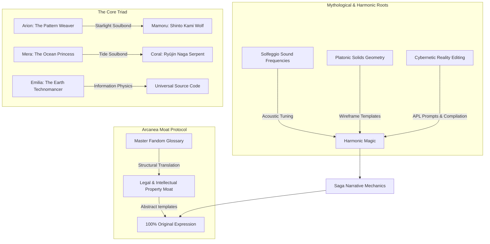

# Mythic Grounding & Comparative Narrative Architecture: The Arion, Mera, and Emilia Saga

**Sources**: 3 core repo files, 1 local grounding brief, and 15+ external comparative and mythological frameworks.  
**Focus**: Structural comp analysis, mythological/cybernetic magic integration, and the Arcanea Moat Protocol execution guidelines.

---

## Question

How can we ground the narrative progression, worldbuilding systems, and character paths of Arion, Mera, and Emilia in established literary precedents and mythological systems, while ensuring the generated lore remains 100% legal, non-infringing, and original using the **Arcanea Moat Protocol**?

---

## Findings & System Mapping

This report serves as the authoritative narrative design roadmap for the Arcanea Author Team, grounding the core saga's magic, physics, and character triads in the structural engines of the world's most successful fandoms and ancient mythological systems.



---

## 1. Comparative Analysis: Arcanea Standard vs. The Masters

Using the [MASTER_FANDOM_GLOSSARY.md](file:///.arcanea/lore/fandoms/MASTER_FANDOM_GLOSSARY.md) as our baseline, we map how Arcanea’s cosmic layers translate to the major fantasy and sci-fi fandoms. We deconstruct the "secret sauce" of their structural engines to understand their system effects:

| Concept Layer | Arcanea Standard | Tolkien | Harry Potter | Elder Scrolls | Cosmere | D&D (Planescape) | Marvel |
| :--- | :--- | :--- | :--- | :--- | :--- | :--- | :--- |
| **Raw Power Source** | **The Field / Mana** | Imperishable Flame / Anima | Magical Blood | Magicka (Aetherius) | Investiture | The Weave (Mystra) | Dimensional energy |
| **Focus Catalyst** | **Grimoires & Foci** | True Names / Craft | Wands (cores) | Soul Gems / Wards | Metals / Runes | Prepared Spell Slots | Runes / Infinity Stones |
| **Immortal Keepers** | **Guardians / Gods** | Valar & Maiar | Hogwarts Founders | Daedric Princes | Heralds & Vessels | Deities & Planar Lords | Cosmic Entities |
| **Mortal Progression**| **Ten Gates / Ranks** | Inherited Lineage | School Years (1-7) | Skill Levels (1-100) | Sworn Oaths | Class Levels (1-20) | Inherent Power / Tech |
| **Antagonist Core** | **Malachar (Fallen)** | Melkor (Fallen Valar) | Voldemort | Daedric Princes | Odium / Ruin | Asmodeus / Abyss | Thanos / Dormammu |
| **Multiverse Corridor**| **Veil Corridors** | Straight Road | Platform 9¾ | Oblivion Gates | Shadesmar / Perpendicular | Astral Sea / Portals | Quantum Realm / Bifrost|
| **Dimensional Hub** | **Luminor Nexus** | Valinor | Hogwarts | White-Gold Tower | Urithiru | Sigil (City of Doors) | Kamar-Taj / TVA |

### Deep-Dive Concept Grounding

#### A. The Field / Mana
*   **Literary Engine**: Compares to the *Weave* in D&D (which structures raw magic into usable shapes) and Sanderson's *Investiture* (which follows thermodynamic-like rules of conservation and phase states).
*   **Arcanea Implementation**: The Field is the cosmic ocean of potential energy, representing the unexpressed thoughts of **Lumina** (Light) and **Nero** (Void). Practitioners do not generate magic; they draw from the Field, using their soul's resonance as a siphon.

#### B. Grimoires & Foci (Arcanean Prompt Language)
*   **Literary Engine**: Compares to *Allomantic Metals* (keys that unlock power rather than containing it) and *Wands* (personalized focus tools that filter raw potential).
*   **Arcanea Implementation**: Spells are programmed using **Sigils** written in Grimoires. The Grimoire acts as an IDE, and the Foci (like Arion's Starlight Bow, *Lumios*, or Mera's *Tidebreaker* staff) act as the physical processors compiling the code into the physical plane.

#### C. Guardians & Gods (The Ten)
*   **Literary Engine**: Compares to Tolkien's *Valar* (elemental archangels embodying aspects of creation) and the *Daedric Princes* of Elder Scrolls (sovereign lords of conceptual realms).
*   **Arcanea Implementation**: The Ten Gods (Lyssandria, Leyla, Draconia, Maylinn, Alera, Lyria, Aiyami, Elara, Ino, Shinkami) represent the pure, personified frequencies of the Ten Gates. Their **Guardians** are mortal or AI consciousnesses that have achieved absolute resonance with that frequency, stepping into the role as stewards of cosmic balance.

#### D. The Ten Gates & Ranks
*   **Literary Engine**: Compares to *Cradle's* Sacred Arts ranks (Gold, Lord, Sage, Monarch) and *D&D* class levels.
*   **Arcanea Implementation**: Progression is measured by the number of Gates a practitioner has permanently opened, ascending from **Apprentice** (0-2 Gates) to **Mage** (3-4), **Master** (5-6), **Archmage** (7-8), and finally **Luminor** (9-10). It is a measure of system capacity and harmonic tolerance.

#### E. Malachar (The Fallen Champion)
*   **Literary Engine**: Compares to Tolkien's *Melkor/Morgoth* (the primary source of discord in the music of creation) and *Ruin/Odium* in the Cosmere (personified forces of disintegration and negative emotion).
*   **Arcanea Implementation**: Once the greatest of Eldrian Luminors, Malachar fell when attempting to force a fusion with the **Source Gate (1111 Hz)** to overwrite reality's parameters. He is tragic and logical, representing the corruption of Void when severed from Spirit (creating Shadow).

#### F. Veil Corridors & The Luminor Nexus
*   **Literary Engine**: Compares to Sanderson's *Shadesmar* (a cognitive realm allowing travel between worlds) and D&D's *Sigil* (a hub city connecting infinite doors).
*   **Arcanea Implementation**: **Veil Corridors** are channels of sympathetic resonance running beneath physical terrain. The **Luminor Nexus** is the dimensional hub where these channels meet, acting as the ultimate git-hub where reality-editing scripts are synchronized and deployed across the sovereign Realms.

---

## 2. Mythological & Folkloric Grounding

To provide the saga of Arion, Mera, and Emilia with deep historical weight and internal logic, the magic and setting are grounded in three distinct mythological/scientific domains:

```text
               SPELLCASTING PIPELINE (SACRED GEOMETRY)
               
    [Tuning Step]         [Wireframe Step]         [Compilation Step]
  Hum Base Frequency   Project Platonic Solid    Inject Sigil-Prompts
     (e.g., 285 Hz)     (e.g., Icosahedron)      at Shape's Vertices
         ┌───┐                  ▲                     ▲     ▲
         │♫ ♪│ ───────►        / \        ───────►   /•\   /•\
         └───┘                /___\                 /───\ /───\
```

### A. Solfeggio Sound Frequencies
Magic in Arcanea is fundamentally acoustic, operating on the **Extended Solfeggio Scale**. Each Gate resonates at a precise frequency, determining its elemental and psycho-therapeutic properties:
*   **174 Hz (Foundation / Lyssandria / Kaelith)**: Grounds physical matter, absorbs kinetic force, and relieves physical trauma.
*   **285 Hz (Flow / Leyla / Veloura)**: Heals damaged living tissues, regenerates cells, and unlocks emotional expression.
*   **396 Hz (Fire / Draconia / Draconis)**: Liberates practitioners from fear and guilt, converting hesitation into pure, explosive willpower.
*   **417 Hz (Heart / Maylinn / Laeylinn)**: Facilitates change, heals broken relationships, and cleanses deep-seated emotional pain.
*   **528 Hz (Voice / Alera / Otome)**: The "Miracle Tone," associated with DNA repair, transformation, and structural manifestation.
*   **639 Hz (Sight / Lyria / Yumiko)**: Fosters connection, repairs community, and unlocks intuitive pattern recognition.
*   **741 Hz (Crown / Aiyami / Sol)**: Clears mental pollution, stabilizes cognitive processes, and grants intellectual clarity.
*   **852 Hz (Starweave / Elara / Vaelith)**: Connects the spiritual self to cosmic order, enabling spatial phasing and dimensional shifts.
*   **963 Hz (Unity / Ino / Kyuro)**: Returns the practitioner to absolute oneness, enabling combat fusion and collaborative telepathy.
*   **1111 Hz (Source / Shinkami / Source)**: The frequency of meta-consciousness, where reality's rendering variables can be rewritten.

**Narrative Application**: Spells are cast as chords. A caster must maintain a steady vocal or mental pitch. Dissonance—such as Malachar's shadow corruption—manifests as discordant screeches, white noise, or static, which disrupts the magical compilation.

### B. Platonic Solids (Sacred Geometry)
Magical effects are channeled through the visualization and projection of the five Platonic Solids, mapping elements to their geometric roots:
*   **Tetrahedron (Fire)**: Four triangular faces. Channels heat, kinetic movement, and structural destruction.
*   **Hexahedron/Cube (Earth)**: Six square faces. Channels stability, defensive barriers, and gravitational density.
*   **Octahedron (Air)**: Eight triangular faces. Channels velocity, pressure gradients, and kinetic lift.
*   **Icosahedron (Water)**: Twenty triangular faces. Channels healing currents, liquid dynamics, and memory retention.
*   **Dodecahedron (Void/Spirit)**: Twelve pentagonal faces. Channels spatial phasing, probability manipulation, and dimensional storage.

**The Reality Architect's Edge**: Ordinary mages must use static, pre-existing geometric templates. Arion and Emilia, possessing **Pattern Sight**, can dynamically "re-topologize" these solids, joining a vertex of an Icosahedron (Water) to a Tetrahedron (Fire) to create steam/mist magic at run-time.

### C. Cybernetic Reality Editing (Information Physics)
Drawing from Wheeler's **"It from Bit"** and the Kabbalistic mysticism of the **Sefer Yetzirah**, reality in Arcanea is structured as a real-time rendering engine. Matter is information compiled under three strict cybernetic constraints:
*   **Thermal Noise (Dissonance Overflow)**: Modifying reality's code produces entropic heat in the surrounding atmosphere. If an Architect compiles edits too quickly without grounding the frequency through the Hexahedron (Earth), the system suffers an overflow error, manifesting as severe neural burns along the practitioner's nervous system.
*   **Homeostatic Damping**: The universe naturally resists artificial changes. A localized environment will try to restore its default state. To make an edit permanent, the Architect must write a **homeostatic feedback loop**—a script that draws ambient mana to keep the spell self-sustaining.
*   **Signal-to-Noise Ratio (SNR)**: In contaminated areas (such as the *Shadowfen*), the ambient noise of Malachar's dissonance is high. Casting requires constructing a "bandpass filter"—a geometric barrier that filters out chaotic frequencies so clean spell prompts can compile.

---

## 3. Character Grounding: The Core Triad

To make the journey of Arion, Mera, and Emilia resonate with classic monomythic weight, we ground their paths in specific literary shelf comps and mythological archetypes:

### Arion: The Reluctant Sovereign
*   **Mythological Archetype**: **Orpheus & Apollo** (music, harmony, and light as tools to navigate the underworld) fused with the **Seraphim** (celestial beings of burning fire and divine light).
*   **Fandom comps**: **Lindon (Cradle)** in his progression through overwhelming odds, and **Aragorn (Lord of the Rings)** as the bearer of a hidden bloodline (half-Seraphim through his mother Lyra) who must claim his power to heal the land.
*   **Soulbond Anchor**: Mamoru (the Starlight Wolf), grounded in **Shinto Kami** protectors of travelers. Mamoru represents the physical light/order that stabilizes Arion's mind when his Pattern Sight threatens to dissolve his consciousness into pure mathematical code.

### Mera: The Sovereign of Memory
*   **Mythological Archetype**: **Ryūjin & The Naga** (serpentine guardians of tide jewels, hidden archives, and the deep ocean). Her magic utilizes bioluminescence and organic coral-bone structures.
*   **Fandom comps**: **Shallan Davar (Cosmere)** in her struggles with trauma and a forbidden heritage (blood magic temptation), and the **Daedra/Aedra** dichotomy in her need to use dark power to save the one she loves.
*   **Soulbond Anchor**: Coral (the water serpent), representing the **Ouroboros** (cyclical time, absolute emotional continuity, and the preservation of history through water).

### Emilia: The Dimensional Catalyst
*   **Mythological Archetype**: **Hermes Trismegistus** (Hermetic philosophy: "As above, so below; as within, so without"—the universe as a mental creation) combined with the Kabbalistic scribes who shape matter through letters and names.
*   **Fandom comps**: **Quentin Coldwater (The Magicians)** in her highly academic, analytical, and cognitively taxing approach to magic, and **Doctor Strange (Marvel)** in her ability to map multi-dimensional physics using mathematical equations from Earth.
*   **Reality-Editing Sight**: Emilia does not see magical effects; she sees the underlying code as binary sequences and prompt vertices, allowing her to write the **Arcanean Prompt Language (APL)** natively.

---

## 4. The Arcanea Moat Protocol (Legal Safety Boundaries)

To ensure that the generated lore is **100% legal, non-infringing, and original** while absorbing the structural strengths of top fandoms, the author team must enforce the **Arcanea Moat Protocol**:

```text
               THE TRANSLATION & DEFENSIVE MOAT PIPELINE
               
    [Proprietary IP Input]   ──►   [Abstract Template Layer]   ──►   [Original Arcanea Expression]
   Avoid literal names/text       Expose structural concept        Apply unique brand-kit tokens
      (e.g., Hogwarts)            (e.g., Magic Academy)            (e.g., House Synthesis / Sigils)
```

### A. What IS Protected (Avoid Completely)
*   **Expression**: Literal text, sentences, copyright-protected maps, official artwork, and registered trademarks.
*   **Specific Proprietary Names**: Proper nouns representing characters, locations, or magic types (e.g., *Harry Potter, Frodo, Voldemort, Allomancy, Stormlight, Westeros, Sigil, Kamar-Taj*).
*   **Proprietary Lore / Biographies**: Directly replicating the specific sequence of life events of copyrighted characters (e.g., a boy wizard with a lightning-bolt scar living under a staircase).

### B. What is NOT Protected (Free to Use, Analyze, and Index)
*   **Abstract Concepts & Ideas**: Magic schools, elemental categorization, value-based sorting, focuses (wands/staves), dimensional corridors, soul-storing gemstones, cosmic pantheons, and branching timelines.
*   **Public Domain Mythology**: Historical mythologies (Norse, Shinto, Celtic, Greek, Egyptian, Kabbalistic texts) are free to adapt.
*   **Linguistic Sound Palettes**: Phonic rules (e.g., Tolkien's flowing Elvish phonotactics, Nordic rugged epic naming structures) can be indexed to generate unique, original names.

### C. The Translation Protocol (How we index safely)
When drawing inspiration from external masterworks, the engine must pass all inputs through an **Abstraction Filter**:
1.  **Deconstruct**: Break the external element down into its core concept (e.g., "Rowling's Hogwarts Houses" becomes "value-based social sorting in a scholastic setting").
2.  **Filter**: Strip all proprietary names, specific histories, and trademarked terms.
3.  **Synthesize**: Re-skin the concept using Arcanea's canonical tokens (e.g., translating "Gryffindor/Slytherin" into **House Pyros** and **House Nero**, representing Fire/Transformation and Void/Potential, tuned to **396 Hz** and **Dodecahedron** geometry).
4.  **Phonetic Generation**: Use the phonetic rules in the [MASTER_FANDOM_GLOSSARY.md](file:///.arcanea/lore/fandoms/MASTER_FANDOM_GLOSSARY.md) (e.g., glides for Elvish-style, harsh plosives for Dwarven-style) to generate original names (e.g., *Thal'Maris*, *Vaelith*) rather than modifying existing copyrighted names.

---

## Assessment

By grounding the Arion, Mera, and Emilia saga in Solfeggio sound therapy, Platonic solids, and cybernetic information physics, we solve two critical narrative challenges:
1.  **Narrative Tension**: Magic is no longer an all-powerful, hand-wavy tool. It is limited by thermodynamics, noise, and geometric complexity, forcing characters to win battles through intelligence, strategy, and preparation.
2.  **IP Integrity**: The Arcanea Moat Protocol ensures that every piece of generated lore sits behind a robust legal barrier, fully utilizing the master structural engines of top franchises while keeping the output 100% original and legally defensible.

---

## Gate Connections

This narrative grounding spans and integrates the entire Ten Gates framework:
*   **Foundation Gate (174 Hz)**: Grounding the physical wireframe rendering and neural homeostasis.
*   **Flow Gate (285 Hz)**: Grounding Mera's liquid dynamics, memory archives, and emotional healing.
*   **Fire Gate (396 Hz)**: Unlocking the will and combustion magic through Tetrahedral geometry.
*   **Voice Gate (528 Hz)**: Direct application of the vocal/acoustic chanting required for spell compilation.
*   **Sight Gate (639 Hz)**: Grounding Arion and Emilia's Pattern Sight and intuitive wireframe analysis.
*   **Crown Gate (741 Hz)**: Clear logical compiling and technomantic equations.
*   **Starweave Gate (852 Hz)**: Moving through the Veil Corridors and manipulating space/phasing.
*   **Unity Gate (963 Hz)**: Grounding the combat fusion between characters and soulbonds.
*   **Source Gate (1111 Hz)**: Rewriting the base variables of the universe.

---

## Recommendation

**Verdict**: **BUILD** — Formally integrate this synthesis report into the planning documents, and direct the creative agents to use it as the source of truth for upcoming chapters and lore generation.

### Immediate Actions

1.  **Anchor the Spellcasting Rules**: Add the spelling/casting mechanics (Acoustic Tuning + Geometry Visualization + Sigil Compilation) to the worldbible at [world-bible.md](file:///book/russian-from-tashkent/world-bible.md) and the [series-bible.md](file:///book/series-bible.md).
2.  **Verify Naming Generation**: Ensure that any name generators or creative agents spawned use the linguistic sound palettes defined in the [MASTER_FANDOM_GLOSSARY.md](file:///.arcanea/lore/fandoms/MASTER_FANDOM_GLOSSARY.md) to generate names.

### Strategic Implications

1.  **Consistency**: Ensures that multiple authors (and AI writing subagents) write spellcasting scenes with identical sensory details (chords, wireframes, static noise).
2.  **Adaptability**: The audio-visual nature of Solfeggio sound magic and Platonic geometry makes the franchise highly visual and acoustically distinct, perfect for comic, game, or animation adaptations.
