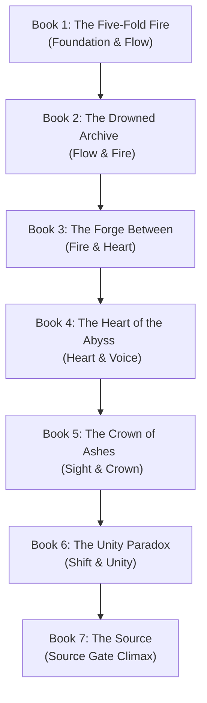

# Arcanea Core Franchise Master Plan
## The Sovereign Creative Universe & Multi-Agent Technical Blueprint

> *"They can copy the code. They cannot copy the soul. The ultimate moat of any AI-assisted creative platform is Curation, Mythology, and Structural Coherence."*
> — Starlight Central Command, June 2026

---

## I. Executive Assessment: The Sovereign Moat

In June 2026, the landscape of AI-assisted creative production has split. Generic platforms focus on producing vast quantities of **commodity tokens** — shallow, prompt-based stories and disconnected fantasy worlds that lack consistency, memory, or emotional resonance. 

Arcanea wins by building a **Sovereign Creative Workspace**: a MIT-licensed, multi-runtime, BYOK (Bring Your Own Key) creative intelligence system where creators retain 100% of their IP, and where the world-building is technically bound by strict continuity layers. 

### The Core Pillars of the Arcanea Moat:
1. **IP Sovereignty:** The creator keeps their own API keys, their own workspace, and 100% of their IP. No platform lock-in.
2. **Duality without Morality Clichés:** The universe runs on **Lumina (Form, Order, Structure)** and **Nero (Potential, Mystery, Chaos)**. Darkness (Nero) is not inherently evil; Shadow is the perversion of the Void when Spirit (Lumina) is stripped away.
3. **Rigid Math-Mythology Integration:** Solfeggio frequencies (174 Hz to 1111 Hz) are not flavor; they dictate Gate resonance, mapping directly to digital-agent behaviors in the multi-agent runtime.
4. **The Ghibli Principle:** Even in the darkest thematic beats, the narrative preserves wonder (e.g., wildflowers growing through a battlefield, sunset light refracting off a ruined glass tower).

---

## II. Lore Foundations & Naming Registry

To maintain a premium, world-class aesthetic and avoid generic fantasy tropes, all written materials, databases, and multi-agent scripts must conform to the following unified canonical registry:

### 1. The Naming Schema
* **Protagonist:** **Kael Thornfield** (he/him). A blacksmith's son from the border town of Ashenmere. Grounded, earthy, and carrying phonetic DNA matching the Foundation Godbeast, *Kaelith*.
* **Historical Echo:** **Aelith of the Mountain Communities** (she/her). A legendary practitioner from the Second Age who opened five Gates and died peacefully. Her name serves as a historical mirror to Kael's journey.
* **Sable Luminaire** (she/her): Expelled Luminary prodigy with a hidden Void affinity. Represents the tension of concealing your true element in a Light-dominated institution.
* **Ash** (no surname): Fire-affinity channeler of Ashwalker descent, co-founded the Forge's young insurgent faction.
* **Elio Songwright** (he/him): Heart-resonant channeler, rejected by formal academies, whose magic manifests through acoustic resonance.
* **Lira Ashenmere** (she/her): The non-channeler anchor, leader of the *Commonground* political movement representing the ungifted populations.
* **Darin Solace** (he/him): The broken guide. Expelled Luminary genius who saw the true history of the Accord of Three during his Sight Gate trial.

### 2. The Institutions
* **The Luminary** (formal: *The Luminary at Crystalpeak*): Floating academy above the Celestine Range (House Lumina).
* **The Draconis Forge** (shorthand: *The Forge*): Built into the volcanic caldera of Mount Pyralis (House Ignis).
* **The Abyssal Athenaeum** (shorthand: *The Athenaeum*): Sub-oceanic library and research academy located in the sunken city of *Thal'Maris* (House Aqualis).

### 3. The Ten Gates & Solfeggio Scale
Solfeggio frequencies serve as **backend-only metadata** to guide soundscapes, text generation, and agent states. They are **never** exposed in dialogue or character-facing text.

| Gate | Name | Guardian | Godbeast | Frequency | Domain |
| :--- | :--- | :------- | :------- | :-------- | :----- |
| 1 | Foundation | Lyssandria | Kaelith | 174 Hz | Grounding, Survival, Basalt |
| 2 | Flow | Leyla | Veloura | 285 Hz | Surrender, Water-Memory, Tide |
| 3 | Fire | Draconia | Draconis | 396 Hz | Will, Transformation, Caldera |
| 4 | Heart | Maylinn | Laeylinn | 417 Hz | Compassion, Empathy, Garden |
| 5 | Voice | Alera | Otome | 528 Hz | Truth, Expression, Spire |
| 6 | Sight | Lyria | Yumiko | 639 Hz | Probability, Foresight, Mirror |
| 7 | Crown | Aiyami | Sol | 741 Hz | Service, Leadership, Throne |
| 8 | Starweave | Elara | Vaelith | 852 Hz | Perspective, Connection, Bridge |
| 9 | Unity | Ino | Kyuro | 963 Hz | Partnership, Synthesis, Conclave |
| 10 | Source | Shinkami | Source | 1111 Hz | Meta-Consciousness, Origin |

---

## III. The 7-Book Core Saga Narrative Arc

The main spine of the franchise tracks **Kael Thornfield’s** journey through the opening of the Ten Gates, mirroring the tragic historical path of **Malachar Lumenbright**, but choosing a different ending.



### Book 1: The Five-Fold Fire
* **Gates Featured:** Foundation (Primary), Flow (Secondary)
* **Logline:** When Kael Thornfield, a nineteen-year-old blacksmith's son, accidentally channels all five elements to smother a wildfire, he is dragged into the Luminary under a cloud of fear — because the last person who could do what he does became the Dark Lord Malachar.
* **Climax:** During the Triennium joint examinations, Kael's Void affinity destabilizes. In a moment of survival, he opens the Foundation Gate. Lyssandria manifests as a nine-foot obsidian goddess, declaring: *"Finally."*

### Book 2: The Drowned Archive
* **Gates Featured:** Flow (Primary), Fire (Secondary)
* **Logline:** To understand his rare nature, Kael travels to the Abyssal Athenaeum, only to discover that the records of past Five-Fold channelers have been systematically erased from the water-memories.
* **Climax:** Deep in the undersea library, Kael opens the Flow Gate. His consciousness floods into the water-memory network. He witnesses the censored memories of the *Accord of Three* and realizes their authority is built on an ancient lie.

### Book 3: The Forge Between
* **Gates Featured:** Fire (Primary), Heart (Secondary)
* **Logline:** With the academies on the brink of war, Kael trains at the volcanic Draconis Forge to become a weapon. In the caldera's depths, he hears the voice of Malachar projecting from his cracking prison, arguing that his fall was driven by compassion, not malice.
* **Climax:** The Shadowfen seal suffers a partial breach. Kael opens his Fire Gate to save the caldera, but his flame turns Void-corrupted, nearly consuming his rival Roshan. 

### Book 4: The Heart of the Abyss
* **Gates Featured:** Heart (Primary), Voice (Secondary)
* **Logline:** As the Academy War erupts, Kael leads a team into the Shadowfen to check the seal, while Vesper discovers her terrifying lineage as Malachar's direct descendant.
* **Climax:** In the depths of the Fen, Kael opens his Heart Gate through an act of radical compassion: he forgives Malachar's suffering rather than his deeds. The Voice Gate opens immediately after as he speaks truth to the Void, silencing Malachar's whispers.

### Book 5: The Crown of Ashes
* **Gates Featured:** Sight (Primary), Crown (Secondary)
* **Logline:** The floating Luminary falls. Hunted by all sides, Kael gains Malachar's probability-sight and is asked to lead the surviving mages, refugees, and civilian movements.
* **Climax:** Kael opens the Crown Gate, accepting the burden of leadership not in glory, but in the painful commitment to lead a broken coalition without demanding absolute certainty.

### Book 6: The Unity Paradox
* **Gates Featured:** Shift (Primary), Unity (Secondary)
* **Logline:** Malachar walks free, offering the world an end to suffering through total dissolution. Kael must negotiate a peace treaty between the warring academies, the Ashwalker remnants, and the ungifted resistance.
* **Climax:** During the conclave in the ruins of Ashenmere, Kael opens the Unity Gate. For twelve seconds, all factions experience a moment of complete, unvarnished mutual understanding.

### Book 7: The Source
* **Gates Featured:** Source (The Final Gate)
* **Logline:** Kael stands before the Source Gate, facing the choice between Malachar's path of world-dissolution and the painful, beautiful choice of keeping conscious existence alive.
* **Climax:** Kael opens the Source Gate, choosing to hold pain and joy simultaneously. Together with Vesper, they do not destroy Malachar but let him feel the full spectrum of love and wonder, breaking his cycle of grief and returning him to accountability.

---

## IV. Content Expansion Ladder & Spinoff Series

Top creative teams look at a world as a generator for multiple formats. The Arcanea franchise expands beyond the Core Saga into distinct content tiers:

```
                  [Tier 1: Core Saga]
              (7-Book Kael Thornfield Epic)
                           │
             [Tier 2: Realm Legends (Spinoffs)]
            (Las Tierras de Luz, Tides of Silence)
                           │
             [Tier 3: Sister-Worlds (Elsewhere)]
                 (Heart of Pyrathis Series)
                           │
             [Tier 4: Mirror Realms (Earth Overlays)]
                  (Song of Van Linh Series)
```

### 1. Spinoff Series Outlines
* **The Ashwalker Chronicles:** A gritty, political fantasy following the diaspora of the Ashwalker people. Focuses on the struggle for reclamation and justice in the wake of the Accord of Three's betrayal.
* **The Deep Library Cases:** An investigative, scholarly thriller starring Sable Maren (prior to her escape to the Luminary) solving historical anomalies by decoding censored water-memory texts.
* **The First Luminor:** The tragic prequel epic of Malachar Lumenbright. Ten thousand years of service, the slow accumulation of probability-sight, and his final descent into the Shadowfen.

### 2. Auxiliary Media
* **The Arcanea Codex (Physical Companion):** A premium, in-universe grimoire containing blueprints of the floating Luminary, botanical notes from the Garden of Thorns, and annotated pages from the Malachar Codex.
* **The World Song (Audio Experience):** 10 tracks recorded at the corresponding Solfeggio frequencies (174 Hz to 1111 Hz), representing the harmonic keys to opening each Gate, integrated into audiobooks and e-readers.

---

## V. Technical Integration: The Multi-Agent Pantheon

The technological engine of Arcanea is an AI-native orchestration layer that maps classical mythology and Gate metaphysics to frontier models. This is executed through `opencode-arcanea`.

### 1. Agent-Model Mapping

```
      Classical Deity      ↔     Arcanean Gate      ↔     Model Role
    Hephaestus (Forge)     ↔   Foundation (174 Hz)  ↔   Opus 4.6 (Structure)
    Aphrodite (Love)       ↔   Heart (417 Hz)       ↔   Gemini Pro (Creative)
    Apollo (Art)           ↔   Crown (741 Hz)       ↔   Sonnet 4.6 (Editor)
    Athena (Wisdom)        ↔   Sight (639 Hz)       ↔   GLM-5 (Research/Librarian)
    Calliope (Epic)        ↔   Voice (528 Hz)       ↔   MiniMax 2.5 (Dialogue)
    Hermes (Messenger)     ↔   Starweave (852 Hz)   ↔   Trinity Large (Routing)
    Mnemosyne (Memory)     ↔   Source (1111 Hz)     ↔   Vector DB (SQLite/Milvus)
```

### 2. Execution Runbook
When an author invokes the command:
```bash
agy-run "write chapter 5 using Hephaestus and Calliope"
```

The system executes the following cycle:
1. **The Messenger (Hermes):** Routes the intent and loads the relevant lore context from the **Mnemosyne** SQLite vector store.
2. **The Architect (Hephaestus):** Generates the chapter structure, scene purposes, and pacing markers.
3. **The Muse (Calliope):** Drafts the narrative, expanding descriptions and emotional resonance.
4. **The Editor (Apollo):** Reviews the prose, removes AI clichés (e.g., *elevate, harness, testament*), and enforces the Ghibli Principle.
5. **The Continuity Guardian (Athena):** Verifies the draft against the locked `CANON_LOCKED.md` file.

---

## VI. Immediate Action Roadmap

To lock down the core foundations and begin shipping with greatest excellence, the following steps are queued:

### 1. Local Memory & Registry Setup
- [x] Run naming and pronoun reconciliation across the series bible.
- [x] Run institutional naming updates across written chapters.
- [ ] Implement `scripts/memsearch-sqlite.py` to index the manuscript directory `./book/chapters` and the lore directory `./.arcanea/lore/`.
- [ ] Connect the SQLite vector search tool to the local Claude Code workspace.

### 2. Literary Milestones
- [ ] Draft the detailed chapter-by-chapter beat sheet for *Book 1: The Five-Fold Fire* in `book/chapters/book1/00-beat-sheet.md` based on Kael's perspective.
- [ ] Stage and commit the `PLAN_UNIVERSAL_MARKETPLACE_2026-05-27.md` file after aligning it with the new canonical naming registry.

### 3. Verification Sequence
Run the full repo validation pipeline:
```bash
pnpm install --frozen-lockfile
pnpm run verify:project-workspaces
pnpm run sis:check
pnpm run sis:contracts
pnpm run agents:bridge:check
pnpm --dir apps/web test:media
```

---

**Document Status:** Canonical Core Blueprint v1.0  
**Authority:** Starlight Central Command  
**Last Updated:** 2026-06-12  
