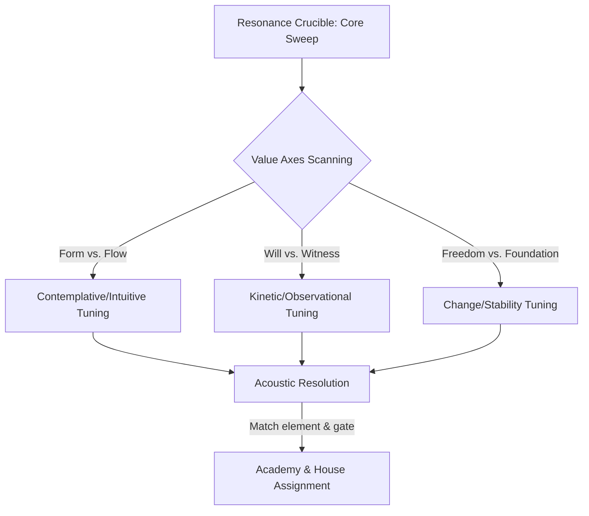
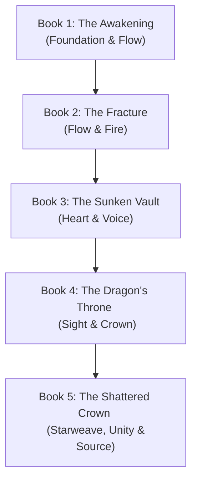

# Arcanea Core Franchise Master Plan: The Arion, Mera, and Emilia Saga
## The Sovereign Creative Universe & Multi-Agent Technical Blueprint

> *"They can copy the code. They cannot copy the soul. The ultimate moat of any AI-assisted creative platform is Curation, Mythology, and Structural Coherence."*  
> — Starlight Central Command, June 2026

---

## I. Executive Assessment: The Sovereign Moat

In June 2026, the landscape of AI-assisted creative production has split. Generic platforms focus on producing vast quantities of **commodity tokens**—shallow, prompt-based stories and disconnected fantasy worlds that lack consistency, memory, or emotional resonance. 

Arcanea wins by building a **Sovereign Creative Workspace**: an MIT-licensed, multi-runtime, BYOK (Bring Your Own Key) creative intelligence system where creators retain 100% of their IP, and where the world-building is technically bound by strict continuity layers. 

### The Core Pillars of the Arcanea Moat:
1. **IP Sovereignty:** The creator keeps their own API keys, their own workspace, and 100% of their IP. No platform lock-in.
2. **Duality without Morality Clichés:** The universe runs on **Lumina (Form, Order, Structure)** and **Nero (Potential, Mystery, Chaos)**. Darkness (Nero) is not inherently evil; Shadow is the perversion of the Void when Spirit (Lumina) is stripped away.
3. **Rigid Math-Mythology Integration:** Solfeggio frequencies (174 Hz to 1111 Hz) are not flavor; they dictate Gate resonance, mapping directly to digital-agent behaviors in the multi-agent runtime.
4. **The Ghibli Principle:** Even in the darkest thematic beats, the narrative preserves wonder (e.g., wildflowers growing through a battlefield, sunset light refracting off a ruined glass tower).

---

## II. Lore Foundations: The Resonance Attunement Engine

In the Eighth Age of Arcanea, sorting is not an arbitrary personality assessment. It is a physical, acoustic, and value-based attunement system conducted within the **Resonance Crucible** at the center of the Luminor Citadel. 

Rather than categorizing individuals by static personality traits, the Resonance Attunement Engine measures a student’s fundamental **Core Frequency Profile** and maps their reactions to specific value axes under pressure.

### The Resonance Crucible
The Crucible is a chamber constructed of gravity-dense **Kaelith Stone** (to ground kinetic force) and silent **Kyuro Void Crystal** (to absorb stray frequencies). When a student enters, they stand upon a tuning platform. The platform does not read thoughts; it sweeps the body with progressive Solfeggio frequencies and monitors how the student's Core vibrates in response.



### The Six Resonance Vectors (Value Axes)
The Engine evaluates students along three primary value dichotomies, which dictate their magical and social sorting:

1. **Form vs. Flow (Structure vs. Adaptation)**
   - **Form**: A preference for patterns, logic, boundaries, and static geometry (attuned to Earth/Wind).
   - **Flow**: A preference for emotional continuity, memory, adaptation, and currents (attuned to Water/Light).
2. **Will vs. Witness (Action vs. Observation)**
   - **Will**: The drive to project power, alter the environment, and force change (attuned to Fire/Light).
   - **Witness**: The drive to observe, record, preserve potential, and remain silent (attuned to Void/Earth).
3. **Freedom vs. Foundation (Change vs. Stability)**
   - **Freedom**: The pursuit of speed, innovation, and liberation from constraints (attuned to Wind/Fire).
   - **Foundation**: The pursuit of stability, loyalty, grounding, and duty (attuned to Earth/Water).

---

### Academy & House Sorting Matrix
The attunement determines both the student's **Academy Campus** (governing their operational training style) and their **House** (governing their social and ethical identity).

| Academy / House | Core Frequency | Dominant Value | Elemental Mode | Sorting Criteria |
| :--- | :--- | :--- | :--- | :--- |
| **The Draconian Forge** / *House Pyros* | **396 Hz (Fire Gate)** | *Valora* (Will, Transformation) | Fire | Resolves conflicts through kinetic friction; projects will outward; seeks growth by burning away the outdated. |
| **The Abyssal Athenaeum** / *House Aqualis* | **285 Hz (Flow Gate)** | *Kardia* (Adaptation, Memory) | Water | Resolves conflicts through absorption and redirection; values emotional history; heals by matching currents. |
| **The Luminor Citadel** / *House Synthesis* | **963 Hz (Unity) & 1111 Hz (Source)** | *Enduran* & *Poiesis* (Synthesis) | All / Prismatic | Capable of holding opposing forces (Light/Void, Earth/Air) in tension; translates between systems; acts as a bridge. |

#### House Pyros (Kinetic / Will)
Students sorted into House Pyros show a strong resonance with the **396 Hz frequency**. Their magical Cores heat up when faced with injustice or confinement. They do not seek comfort; they seek transformation. The sorting ceremony reveals Pyros alignment when the Crucible’s floor glows like cooling magma, and the student's primary sigils manifest as sharp, geometric flame patterns.

#### House Aqualis (Intuitive / Flow)
Students sorted into House Aqualis align with **285 Hz**. Their Cores absorb the acoustic sweeps, quietening the room. They prioritize memory and emotional truth. The Crucible reveals Aqualis alignment by condensing ambient moisture into floating spheres that orbit the student, reflecting their internal emotional state.

#### House Synthesis (Prismatic / Integration)
Sorted only when a student shows near-equal resonance across all five elements and multiple value axes. House Synthesis is extremely rare. During a Synthesis sorting, the Crucible does not settle on a single tone; it resolves into a **harmonic triad** representing the integration of elements. The student's Core glows with a shifting, prismatic light.

---

## III. Flagship Team Diagnostics

### 1. Arion Luminastra — The Reluctant Anchor
*   **Aliases:** The Reality Anchor, Serath's Shadow, The Sentinel of Greenvale
*   **Age:** 19 (at series start)
*   **Pronouns:** he/him
*   **Origin Class:** Arcan (Seraphim bloodline)
*   **Faction:** Academy House Synthesis
*   **House:** Synthesis
*   **Rank:** Apprentice (opening Gates progressively)
*   **Gate Primary:** Foundation (174 Hz)
*   **Gates Open:** 2 (at start)
*   **Element:** All (Multiclassed elemental channels)
*   **Power Source:** Weave (Direct manipulation through Seraphim lineage)
*   **Signature Ability:** *Pattern Sight* — perceives the underlying spatial geometry and code templates of reality.
*   **Limitation:** Every edit to reality generates massive local thermal noise (dissonance) that physically burns his nervous system.
*   **Desire:** To keep his friends safe and live a quiet life, avoiding the destructive destiny expected of him.
*   **Wound:** Witnessing his mother Lyria's self-dissolution into light to save their village, leaving him with an unearned, crushing inheritance.
*   **Mask:** The practical, dry-witted archer who mocks prophecies and claims he is only trying to survive.
*   **Truth:** Power cannot be quarantined. Refusing to wield his gift is a choice that allows destruction; he must direct the code of the universe to protect it.
*   **Silhouette:** A lean, athletic youth carrying a longbow made of crystallized white light (**Lumios**). He stands in a grounded, defensive posture, eyes shifting between stormy blue and prismatic gold. Beside him sits a large white wolf with glowing starlight patterns running through its fur.
*   **Voice Pattern:** Direct, plainspoken, uses agrarian and nature-based metaphors. Rubs his left wrist (where his sigils burn) when stressed.
*   **Sample Line:** *"The universe doesn't care about prophecies, Roshan. It cares about who is left standing when the fire dies."*

---

### 2. Mera Tidecaller — The Flow of Memory
*   **Aliases:** The Ocean's Heart, The Princess of Thal'azur
*   **Age:** 19
*   **Pronouns:** she/her
*   **Origin Class:** Arcan (Atlantean lineage)
*   **Faction:** Academy House Aqualis
*   **House:** Aqualis
*   **Rank:** Mage
*   **Gate Primary:** Flow (285 Hz)
*   **Gates Open:** 3
*   **Element:** Water (Mastery)
*   **Power Source:** Song (Sympathetic resonance and blood-memory)
*   **Signature Ability:** *Tide Link* — channels fluid water magic to link nervous systems, absorbing and healing physical wounds.
*   **Limitation:** Healing others forces her to physically absorb their trauma and pain, leaving temporary scars on her own flesh.
*   **Desire:** To protect Arion, heal every break in the world, and preserve the peace of their childhood.
*   **Wound:** The shame of her dormant Atlantean bloodline, which is associated with forbidden blood magic and ancient hubris.
*   **Mask:** The selfless, nurturing healer who always smiles, assuring others she requires nothing for herself.
*   **Truth:** True healing requires integrating her shadow. She must embrace her blood-magic heritage to stand as an equal combat partner.
*   **Silhouette:** A fluid silhouette clad in ocean-teal robes that shimmer like water. She holds a staff of living coral (**Tidebreaker**) that arches into a water whip. Her dark hair drifts slightly as if submerged, and bioluminescent markings glow along her cheekbones.
*   **Voice Pattern:** Quiet, rhythmic, pauses between sentences like waves retreating. Plays with a small coral pendant when anxious.
*   **Sample Line:** *"You can't patch a broken core with willpower, Arion. If you don't let the power flow, you will shatter from the inside."*

---

### 3. Emilia Chen — The Dimensional Compiler
*   **Aliases:** The Glitch, The L.A. Compiler, Protocol Zero
*   **Age:** 24
*   **Pronouns:** she/her
*   **Origin Class:** Architect (Earth-born traveler)
*   **Faction:** Academy House Synthesis
*   **House:** Synthesis
*   **Rank:** Apprentice (uninitiated to traditional magic, highly adept at theory)
*   **Gate Primary:** Unity (963 Hz)
*   **Gates Open:** 1 (upon crossing)
*   **Element:** All (sees magic as binary structure)
*   **Power Source:** Code (APL - Arcanean Prompt Language)
*   **Signature Ability:** *APL Compilation* — translates raw spells into optimized programming syntax, rewriting reality's local physics.
*   **Limitation:** Technomancy requires absolute logic. If she experiences strong emotional distress, her spell compilations fail with syntax errors.
*   **Desire:** To compile a stable gateway back to Los Angeles and restore her normal, predictable life.
*   **Wound:** A lifelong history of isolation and digital alienation, feeling she only belongs behind screens rather than among people.
*   **Mask:** Sarcastic, hyper-rational detachment, treating the magical world as a buggy software program.
*   **Truth:** She cannot code her way out of connection. She must feel the world emotionally to complete the Trinity's bond.
*   **Silhouette:** An asymmetrical posture, wearing a dark L.A. streetwear jacket modified with brass fittings and glowing blue circuitry. Her hands are encased in **Starforge Gauntlets** that project floating, holographic lines of magical code in Geist Mono font.
*   **Voice Pattern:** Fast, modern, heavy use of software development and system architecture jargon. Taps her fingers in a rapid typing rhythm against her thighs.
*   **Sample Line:** *"This spell isn't a memory leak in reality's rendering engine. Give me five minutes to patch it."*

---

### 4. Mamoru — The Starlight Sentinel
*   **Aliases:** The Wolf of Shinkami, The White Comet, The Eleventh Guardian
*   **Age:** Ancient (in spirit), 1 (in physical body)
*   **Pronouns:** he/him
*   **Origin Class:** Bonded (Divine Beast)
*   **Faction:** Independent (tied to Arion)
*   **House:** Synthesis
*   **Rank:** Guardian-Ascendant
*   **Gate Primary:** Source (1111 Hz)
*   **Gates Open:** 4 (manifested through bond)
*   **Element:** Lightning / Light
*   **Power Source:** Anima (Raw cosmic life force)
*   **Signature Ability:** *Starlight Shifting* — teleports through shadows by converting his physical form into coherent light pulses.
*   **Limitation:** His strength is tied to Arion's psychological state; if Arion's will wavers, Mamoru loses physical density.
*   **Desire:** To guard Arion's sanity and ensure the alignment of the Ten Gates is completed.
*   **Wound:** Splintered from the great wolf Shinkami during Malachar's fall, carrying the trauma of ancient failures.
*   **Mask:** A stoic, silent animal companion who communicates only through dry, telepathic sarcasm.
*   **Truth:** He is not just an instrument of destiny or a guide; he is an independent consciousness whose choices decide the fate of the world.
*   **Silhouette:** A massive white wolf standing nearly five feet tall at the shoulder, with fur that seems to drift like nebula dust. Constellation markings glow along his flanks. When shifted, he appears as a tall, white-haired warrior wielding a spear of lightning.
*   **Voice Pattern:** Telepathic projection. Brief, dry, often sarcastic. Speaks directly to the mind with a resonant, low timbre. Snorts or tilts his head when humans speak illogical concepts.
*   **Sample Line:** *«You are staring at the wireframe again, boy. Breathe. The code won't bite, but the shadow behind it will.»*

---

## IV. The Trinity Integration Matrix

The Trinity does not function through simple cooperation; they operate as a **three-part computational engine** that compiles and executes changes to reality.

```
                  [ EMILIA CHEN ]
                    (Structure)
                     APL Code
                        │
                        ▼
    [ MERA TIDECALLER ] ───► [ ARION LUMINASTRA ]
         (Flow)                     (Will)
     Thermal Damping            Spark Execution
```

### 1. The Functional Alignment (Structure + Flow + Will)
- **Structure (Emilia Chen)**: Emilia provides the logical framework. She analyzes the spell-data, writes the optimal APL prompt, and sets the boundary constraints. Without her, the magic is too chaotic and unstable to form a permanent change.
- **Flow (Mera Tidecaller)**: Mera acts as the biological cooling system. When reality is edited, it produces **thermal noise (dissonance)** that burns the caster's body. Mera channels her water and blood magic to absorb this heat, maintaining homeostasis. Without her, the feedback loops would kill the team.
- **Will (Arion Luminastra)**: Arion provides the raw power and target execution. Wielding the Seraphim spark in his blood, he directs the starlight bow to fire the compiled prompt at the target coordinate. Without his will, the code has no engine to compile it.

### 2. Emotional Tension & Friction Points
- **The Romantic Friction**: The unrequited history between Arion and Mera creates a subtle, emotional dampening in their magical link. When Emilia enters, her instant, fated connection with Arion disrupts this balance. Mera feels displaced, while Emilia feels like an intruder in a history she didn't write.
- **Systemic Skepticism vs. Faith**: Emilia views magic as a system to be controlled; Mera views it as a sacred current to be loved; Arion views it as a weapon he never wanted. This ideological conflict creates friction during combat compilation.

### 3. The Resolution: The 963 Hz Chime
For the Trinity to succeed, they must open the **Unity Gate (963 Hz)**. This occurs when they accept their codependency: Emilia surrenders control to the current, Mera accepts the darkness of her blood to defend the team, and Arion accepts his role as the executor of their shared will. When aligned, their three cores hum in a single chord, allowing them to rewrite the local rules of reality without generating thermal feedback.

---

## V. The 5-Book Core Saga Narrative Arc

The main spine of the franchise tracks the journey of Arion, Mera, and Emilia from their village roots to their ascension as Reality Architects who compile the future of the world.



### Book 1: The Awakening
*   **Gates Featured:** Foundation (Primary), Flow (Secondary)
*   **Settings:** Greenvale, The Ash Road, Whispering Canyons, Grotto of Corrupted Whispers, Shael Pass, Convergence City.
*   **Logline:** When his village is destroyed by a shadow army and his mother sacrifices herself, Arion must flee to Convergence City with his healer friend Mera and a starlight wolf pup, Mamoru. As he enters the Academy, his Pattern Sight triggers a portal that pulls Emilia Chen, a software engineer from L.A., into the Realm.
*   **Climax:** During the intake examinations, Arion's core destabilizes. He stabilizes his Foundation Gate, while Emilia uses her phone's binary clock to align with the academy's leyline, stabilizing the gate and proving they are both Reality Architects.

### Book 2: The Fracture
*   **Gates Featured:** Flow (Primary), Fire (Secondary)
*   **Settings:** Convergence City, Lúmendell (Eldrian Forest, home of Yggdrasil's roots).
*   **Logline:** The search for the first Creation Fragment leads the group into the deep Eldrian forests. As Emilia starts mapping magic as software code (APL), she and Arion develop an electric, fated bond, causing intense romantic friction with Mera.
*   **Climax:** An ambush by the Void Ascendants forces the group into the deep roots of Lúmendell. Arion opens the Fire Gate to drive back the shadow, but his raw flame nearly consumes the forest. Mera stabilizes his feverish core, solidifying their codependency.

### Book 3: The Sunken Vault
*   **Gates Featured:** Heart (Primary), Voice (Secondary)
*   **Settings:** Thal'azur (Sunken Realm, Deepcrown) & Noctávar (Dark Elf Underdark) via Mar Arcano sea.
*   **Logline:** The group travels to the sub-oceanic libraries of Thal'azur to retrieve the water-memories of the First Age. Mera's dormant Atlantean royalty is revealed, forcing her to choose between the safety of the healer's path and the crushing force of her blood-magic ancestry.
*   **Climax:** A Nero Shard strike threatens to flood the undersea city. Mera accepts her dark heritage and opens the Heart Gate, linking the entire city's life force to her staff. Arion opens the Voice Gate, chanting the harmonic counter-resonance to shatter the Nero Shard.

### Book 4: The Dragon's Throne
*   **Gates Featured:** Sight (Primary), Crown (Secondary)
*   **Settings:** Drak'thar (Dragon Isles, volcanic calderas) & Shattered Isles.
*   **Logline:** The Academies go to war. Arion trains at the Draconian Forge, while Emilia compiles the first functional APL compiler. Mamoru undergoes a massive evolution, achieving a humanoid starlight warrior form to defend Arion.
*   **Climax:** The volcanic calderas of Drak'thar erupt under shadow influence. Emilia compiles a homeostatic feedback loop that rewrites the thermal rules of the magma. Arion opens the Sight Gate, perceiving the true coordinate of the shadow-caster, and fires *Lumios* to seal the volcanic rift.

### Book 5: The Shattered Crown
*   **Gates Featured:** Starweave, Unity, Source (The Final Gates)
*   **Settings:** The Shadowfen (Blink-swamp where Malachar is sealed) & The Ultraworld.
*   **Logline:** The floating Luminary falls. The Trinity leads the surviving mages into the Shadowfen to confront Malachar. To win, they must enter the Ultraworld—the crystalline, digital-arcane landscape where reality is compiled.
*   **Climax:** Standing before the Source Gate, the Trinity opens the Unity Gate (963 Hz). For twelve seconds, they operate as a single mind, compiling a patch that cleanses the shadow from Malachar's core, returning him to light and bringing the Seventh Age to a peaceful beginning.

---

## VI. The Modular Resonance Network (MRN) Scaling Strategy

To scale the Arcanea franchise to dozens or hundreds of books while maintaining high styling, consistency, and pacing, we implement the **Modular Resonance Network**.

### 1. Novella Nodes (30,000–45,000 words)
*   **Optimal Context Size**: Novellas fit perfectly within LLM context windows, allowing AI writing agents to maintain absolute vocabulary, formatting, and character consistency without token degradation.
*   **Decoupled Campaigns**: Instead of a linear sequence where Book $N+1$ waits for Book $N$, the MRN splits the series into concurrent regional campaigns. Squads of writing agents can draft the *Sunken Seas* campaign and the *Eldrian Forest* campaign in parallel.
*   **Directed Acyclic Graph (DAG) Structure**: Novellas act as nodes in a graph. Edges represent physical corridors or crossover events (like *The Gate Storm* crossover at the end of Arc 2).

### 2. The Three-Act Harmonic Arc
Every novella node is structured around **harmonic wave dynamics** representing the modulation of frequency:
*   **Act I: Dissonance (0% - 25%)**: A discordant wave (a Nero strike, corrupted Voidtouched, or an environmental clash) disrupts the status quo. The protagonist's magic fails to align with the threat.
*   **Act II: Interference (25% - 75%)**: 
    *   *Destructive Interference (Midpoint)*: The protagonist tries to force the situation using old magic, causing neural static or energy backlashes.
    *   *Constructive Interference*: The protagonist aligns with allies and uses Vael Crystals to tune their Core to the challenge.
*   **Act III: Resonance (75% - 100%)**: The protagonist opens the target Gate, performs a Solfeggio attunement, and neutralizes the dissonance in a standing wave of harmony.

### 3. Hard Magic Laws (Sanderson's Laws Applied)
*   **Conservation of Frequency**: Casters cannot create magical energy. They must draw it from the Field or metabolic stamina. Altering temperature (Fire) requires cooling the adjacent air.
*   **Frequency Shear**: Casters must climb the Gates sequentially. Attempting to bypass a lower Gate (e.g., trying to use 639 Hz Sight without stabilizing 174 Hz Foundation) causes cognitive shear, leading to neural collapse or Void corruption.
*   **Piezoelectric Vael Crystals**: Crystals act as capacitors. Meditating with a crystal tunes the meridians to a specific frequency. Over-drawing energy shatters the crystal.

---

## VII. The Arcanea Moat Protocol (Legal Safety Boundaries)

To ensure that the generated lore remains **100% legal, non-infringing, and original** while absorbing the structural strengths of top fandoms, the author team enforces the **Arcanea Moat Protocol**:

### A. What IS Protected (Avoid Completely)
*   **Expression**: Specific sentences, copyright-protected maps, official artwork, and registered trademarks.
*   **Specific Proprietary Names**: Proper nouns representing characters, locations, or magic types (e.g., *Harry Potter, Frodo, Voldemort, Allomancy, Stormlight, Westeros, Sigil, Kamar-Taj*).
*   **Explicit Biographies**: Directly replicating the copyrighted sequence of life events of external characters.

### B. What is NOT Protected (Free to Use & Index)
*   **Abstract Concepts**: Magic schools, value-based sorting ceremonies, focusing staves, parallel planes, soul-storing gemstones, and branching timelines.
*   **Public Domain Mythology**: Adapting historical mythologies (Norse, Shinto, Celtic, Greek, Egyptian, Kabbalistic texts).
*   **Linguistic Sound Palettes**: Phonic rules can be indexed to generate unique, original names.

### C. The Translation Protocol (The Abstraction Filter)
When drawing inspiration from external masterworks, the engine passes all inputs through an Abstraction Filter:

```
[Proprietary IP Input]   ──►   [Abstract Template Layer]   ──►   [Original Arcanea Expression]
Rowling's Hogwarts             Value-Based Sorting               Crucible sorting into House Pyros
Sanderson's Cosmere            Thermodynamic Energy Rules        Resonance laws & Vael Crystals
```

*   **Linguistic Sound Palette (Tolkien Sylvan)**: Use voiced fricatives (`v`, `z`), liquid consonants (`l`, `m`, `n`, `r`), and long open vowels (`ae`, `ea`, `ie`, `ú`). Avoid hard plosives (`g`, `k`, `p`, `t`) at the end of syllables to construct gliding, original names like **Lúmendell** (Lúmen + dell) and **Thal'Maris** (Thal' + Maris).

---

## VIII. Immediate Action Roadmap

To lock down the core foundations and begin shipping with greatest excellence, the following steps are queued:

1.  **Staging and Committing**: stage our newly written Chapters 1–6 and delete legacy chapters 1–10.
2.  **Verify Workspace**: Run `pnpm run verify:project-workspaces` to ensure typecheck and Playwright E2E tests are green.
3.  **Core Foundation Mapping**: Update `book/series-bible.md` to map the Arion, Mera, and Emilia saga as the canonical book framework.
4.  **Teamwork Preview**: Prepare the repository for parallel multi-agent drafting on upcoming Campaign Waves.

---

**Document Status:** Canonical Core Blueprint v2.0  
**Authority:** Starlight Central Command  
**Last Updated:** June 14, 2026  
