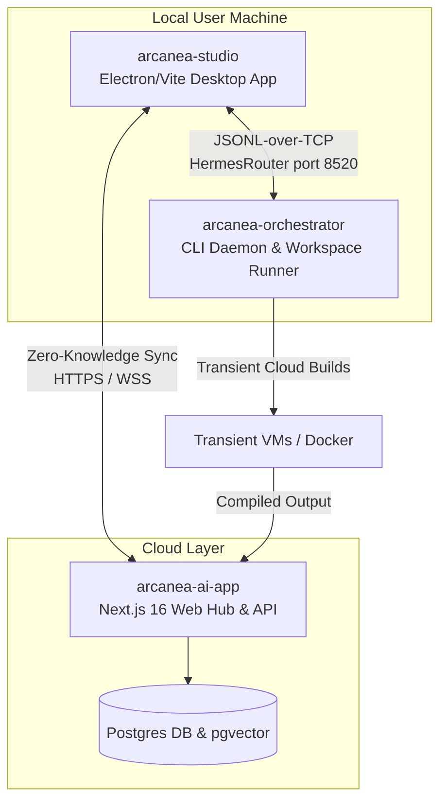

# Product Requirement Document: Path C Hybrid Sovereign Engine (SOTA L99)

## 1 · Executive Summary

Traditional creative intelligence systems force creators into an compromise:
1. **SaaS Platforms (Closed Databases):** Provide features like sync and search but strip creators of data privacy, expose intellectual property (IP), and create hosting dependencies.
2. **Local-First Toolkits (Offline-capable):** Keep files private but lack cloud sync, cross-device accessibility, search, and collaborative workbenches.

**Path C** is the **Hybrid Sovereign Sync Engine**. It combines a **local-first, offline-capable, BYOK (Bring Your Own Key)** core with **zero-knowledge cloud sync, pgvector search index, and transient-VM remote compiler**. Creators maintain absolute ownership of their world bibles, media files, and code graphs in open formats (Markdown, JSONML) while enjoying cloud synchronization and team workflows.

```
+-------------------------------------------------------------------------+
|                         THE HYBRID SOVEREIGN ENGINE                     |
|                                                                         |
|  [ LOCAL STUDIO LAYER ] <---(Encrypted JSONL over TCP)---> [ CLIENT ]   |
|   OPFS & IndexedDB                                       Local Disk     |
|          |                                                              |
|          | (Zero-Knowledge Sync via HTTPS/WSS)                          |
|          v                                                              |
|  [ CLOUD STORAGE LAYER ] <---(Cosine Similarity)---> [ PGVECTOR INDEX ] |
|   Encrypted Ciphertext                                 Vector Embeddings|
+-------------------------------------------------------------------------+
```

---

## 2 · Unified Multi-Repository Architecture

Path C coordinates three separate codebases into a seamless execution layer:



### 2.1 Repository Roles & Boundaries

1. **`arcanea-ai-app` (The Cloud Web Hub):**
   * **Role:** Public portal, waitlist collector, Stripe/Whop billing integrator, metadata store, and encrypted backup vault.
   * **Core Stack:** Next.js 16, React 19, Tailwind CSS, Radix UI primitives, Supabase.
   * **Database:** PostgreSQL with the `pgvector` extension for semantic search indexing.
   * **Data Storage:** Serves as a blind cloud storage provider, holding only user-encrypted text, JSONML trees, and local-calculated vector embeddings.

2. **`arcanea-studio` (The Desktop Creative Suite):**
   * **Role:** Desktop app wrapper that provides offline access to the Image, Video, and Audio Forge.
   * **Core Stack:** Electron, Vite, React, IndexedDB, and the Origin Private File System (OPFS).
   * **Processing:** Computes text/image embeddings locally using lightweight WebGPU/ONNX runtimes (Transformers.js), ensuring raw data never leaves the client's machine unless explicitly configured.

3. **`arcanea-orchestrator` (The Local Task Runner):**
   * **Role:** CLI daemon (`@arcanea/arcanea-cli`) running a background TCP message broker (`HermesRouter`) on port `8520`.
   * **Core Stack:** Node.js, Commander, Socket-based IPC.
   * **Task Sandbox:** Creates sandboxed directories for running agent compilers, managing local git worktrees, and executing local scripting pipelines.

---

## 3 · Commercialization & Waitlist Funnel

To support sovereign scaling, Arcanea implements a hybrid monetization model:

### 3.1 The Three-Tier Model

| Tier | Price | Model | Key Features |
|------|-------|-------|--------------|
| **Sovereign (Free)** | $0 / month | BYOK (Bring Your Own Key) | Local IndexedDB, Markdown files, 16 local Luminor agent companions, local zip exports. |
| **Creator** | $12 / month | ZK-SaaS Layer | Encrypted cloud sync, pgvector search, Multiplayer Canvas, 500 Cloud Bench credits. |
| **Studio Bench** | $39 / month | Professional Team | Multi-user roles, custom companion fine-tuning, 2,500 Cloud Bench credits, priority VM queues. |

### 3.2 Waitlist & Pricing Funnel
* **Waitlist:** When a user attempts to enable cloud-sync or multiplayer features, the interface redirects them to the **Founding Circle waitlist** funnel.
* **Credit Attribution:** Cloud Bench tasks (compiling high-resolution videos, running heavy agent code analysis, or rendering graphics) consume credits. Once credits are depleted, operations fall back to local CPU execution or prompt for a credit top-up.

---

## 4 · Whitelabel SaaS Architecture

To compound the ecosystem, developers can whitelabel the Arcanea engine:

1. **Sovereign Templates:** We provide complete deploy scripts to spin up private instances on custom domains (using Vercel + Supabase).
2. **Flexible Auth:** Supports standard Supabase Auth, Auth0, or custom JSON Web Token (JWT) verification systems.
3. **Custom Brand Kits:** Built-in customization using `@arcanea/design-system` allows whitelabel providers to load their own brand tokens, fonts, and assets dynamically via simple YAML configs.

---

## 5 · Legal Moat & Compliance (Dutch BV)

To insulate the corporate entity (**Arcanea Labs BV**, registered in the Netherlands) from copyright and data hosting liabilities, Path C implements a zero-knowledge, BYOK architecture.

### 5.1 Zero Copyright Liability (BYOK Moat)
* The platform does not host model weights or execute raw generation APIs on its own accounts.
* Users input their own API keys (Anthropic, OpenAI, Gemini), establishing a direct contractual relationship between the user and the LLM provider.
* The platform serves solely as an orchestration interface.

### 5.2 GDPR Compliance under ZK-Encryption
* **Plaintext Access:** Because user documents and metadata are encrypted in the browser using keys derived from their private passphrase (via PBKDF2/AES-GCM-256), Arcanea Labs BV has no means of decrypting user data.
* **Data Processor Status:** Under GDPR, encrypted bytes where the processor lacks access to the decryption key are not classified as personal data. This reduces the compliance burden, eliminates data leakage risks, and ensures user privacy.

### 5.3 No-Hosting copyright Shields (EU Safe Harbor / DMCA)
* All synchronized user assets (e.g. story bibles, lore, media) reside on the database as encrypted ciphertext.
* Since the operator cannot inspect, search, or review the contents of these encrypted payloads, it operates as a neutral conduit, shielding the BV from copyright infringement liability.

---

## 6 · SOTA Roadmap (Milestones)

```
[M1: Sovereign Foundation] ---> [M2: ZK-Sync & pgvector] ---> [M3: Cloud Bench VMs]
                                                                     |
[M5: SOTA E2E Production] <--- [M4: Whitelabel & CLI commands] <-----+
```

### Milestone 1: Offline-First Sovereign Foundations (Sprints 1-2)
* Complete local IndexedDB schemas and OPFS cache layers in `arcanea-studio`.
* Verify local zip exports containing full raw Markdown state.

### Milestone 2: Zero-Knowledge Sync & pgvector Indexing (Sprints 2-3)
* Implement browser Web Crypto API wrappers for PBKDF2 and AES-GCM-256 encryption.
* Set up `vault_nodes` tables and index them using HNSW cosine similarity on Supabase.

### Milestone 3: Remote Cloud Bench Execution (Sprint 4)
* Write Docker configurations to spawn transient VMs for compilation scripts.
* Pipe container logs to the web interface in real-time via WebSockets.

### Milestone 4: Whitelabel System & CLI Commands (Sprint 5)
* Implement `@arcanea/arcanea-cli` commands (`install`, `update`, `uninstall`) to manage custom skills.
* Create documentation for deploying whitelabel templates on private infrastructure.

### Milestone 5: Production Hardening & E2E Validation (Sprint 6)
* Run automated Playwright tests, typecheck validations, and push verified code to the `main` branch.
