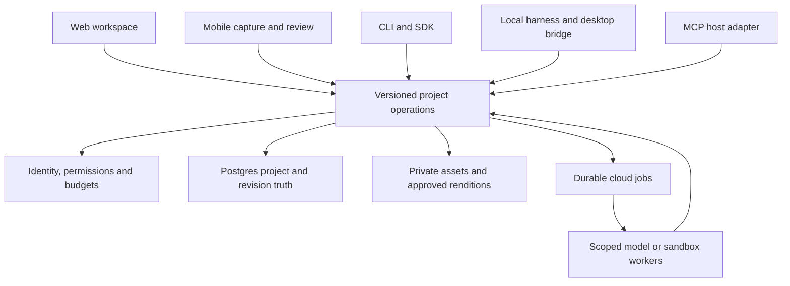

# Creator platform and connected clients

Status: proposed execution order and product contract, 11 October2026. Pair with [branch triage](CURRENT_STATE_BRANCH_TRIAGE_2026-10-11.md). Owner: Codex root; implementation base4441801; programme[276](https://github.com/frankxai/arcanea-ai-app/issues/276), commerce[511](https://github.com/frankxai/arcanea-ai-app/issues/511), credit safety[529](https://github.com/frankxai/arcanea-ai-app/issues/529). Prices, quotas, licensing and production activation are not changed here.

## Who should get value first

Start with an independent author or worldbuilder developing an original setting and manuscript. Their recurring job is to carry decisions about characters, locations and events into the next chapter, make deliberate revisions, recover their work and export it for use elsewhere. This audience is a product hypothesis supported by the accepted Arcanea product direction; willingness to pay and retention are unmeasured.

A small creative team adds scoped contributors, shared revisions and publication approval. A developer or creator who uses local AI tools needs the same project context and operations from their existing harness. Readers need a reliable, accessible reading experience and optional scene exploration. A general-purpose coding IDE, a full social network and autonomous cross-brand publishing each introduce different jobs and should have separate evidence before admission.

The first accepted journey should be: import or create a private world, shape its rules and characters, draft a chapter from selected context, inspect continuity suggestions, accept individual edits, attach approved media, reopen the exact work on another client, and export a usable package. A creator's own decisions stay identifiable. Publication is an explicit later action with rights and permission checks.

Arcanea already has an accepted world-generation/save slice and an author recovery slice. The gap is the connected journey, source/version semantics, useful editorial review and governed media. A live model draft demonstrated a usable starter, with naming/character-element consistency and founding-history gaps. That single comparison did not establish superiority or customer acceptance.

## What each layer means

| Layer                       | Responsibility                                                                                        | Why it earns a place                                                           | Admission proof                                                                                                                                         |
| --------------------------- | ----------------------------------------------------------------------------------------------------- | ------------------------------------------------------------------------------ | ------------------------------------------------------------------------------------------------------------------------------------------------------- |
| Domain and policy contracts | Projects, artifacts, revisions, source links, rights, permissions, budgets and receipts               | The same work means the same thing across clients and providers                | Reuse product-kernel and existing world/author contracts; adapters supply auth, persistence and cumulative limits                                       |
| Web workspace               | Create, edit, review, organize, recover, share and manage the account                                 | Main creator experience and durable project access                             | Actual private save/reopen, keyboard/mobile recovery, correct rights and useful output                                                                  |
| Local harness adapter       | Read selected local files; invoke permitted tools; keep keys local; prepare patches and export/import | Fits existing Codex, Claude, OpenCode or other tools without forcing migration | Fresh consumer install; filesystem boundaries, no ambient upload, interruption and recovery                                                             |
| Cloud job runtime           | Perform explicitly requested background jobs, stream progress, pause for decisions and recover        | Work continues when a browser closes or a phone disconnects                    | Durable operation ID, deadlines, budgets, leases, stored result, cancellation and uncertain-outcome handling                                            |
| CLI                         | Script the same project/import/export/job operations and diagnose setup                               | Automation and repeatable local workflows                                      | One supported command owner, structured output/exit codes and equivalent authorization                                                                  |
| SDK                         | Typed API client and portable contracts for another app                                               | Developers can embed the real capabilities                                     | Packed external consumer; versioned errors, retry policy and revocation tests                                                                           |
| ADK                         | Tested adapters for tools, context, policy and runtime integrations                                   | Helps developers build an agent that uses Arcanea correctly                    | Existing host adapters first; two distinct hosts pass the same bounded task. No new agent framework until a repeated missing capability is demonstrated |
| Desktop                     | Local files, OS keychain, offline drafts and a visible sync/review bridge                             | Native filesystem and offline jobs can justify installation                    | Prove the local bridge first; update signing, device revocation and conflict recovery before release                                                    |
| Mobile                      | Capture ideas, read, annotate, review choices, approve and resume jobs                                | Useful creation moments away from a desk                                       | Responsive web first; native app only when capture/offline/push benefits justify maintenance                                                            |
| MCP                         | Scoped tool access from external AI hosts                                                             | Bring project context into the creator's chosen environment                    | Audience-bound credentials, consent, tenant/source permissions and real external-host acceptance                                                        |

These are responsibilities, not ten products to build simultaneously. Browser UI, CLI, SDK and MCP should call the same governed operations. A prompt or installed policy cannot substitute for authorization enforced at those operations.

For the Arcanea harness, first compare creator-specific context, tools and workflows in existing hosts against maintaining a full coding-harness fork. The first approach focuses on the accepted creator artifact; the second adds upstream integration, provider compatibility and native distribution obligations. Current GitHub evidence shows arcanea-code and oh-my-arcanea are upstream forks with dev default branches, and arcanea-flow is also a fork. Preserve them and inspect their unique behavior. Recommend host adapters for the first connected journey; admit further full-harness work when a measured creator job needs control those adapters cannot supply. This proposal neither archives a repository nor changes its default branch.

## Shared operation contract

Reuse existing accepted envelope/policy primitives. Define tenant and actor, project and artifact ID, immutable source revision/hash, expected destination revision, operation ID and idempotency key, credential mode, model route, permitted tool effects, budget/deadline and cancellation state. Authenticate the actor; the caller's tenant field never grants permission.

Write with an expected revision. A stale write returns a conflict and retains the proposed draft; it does not silently overwrite the newer source. Append new artifact revisions and lineage. Review/approval is tied to the exact revision and expires when it changes. Derived summaries, embeddings and indexes can be rebuilt and must record which source versions they represent. Project facts belong to the creator; accepted facts and tentative model suggestions remain distinguishable.

Job states should distinguish queued, running, awaiting decision, result ready, settling, completed, cancel requested, failed and outcome unknown. These names are a proposed mapping to the accepted billing/job primitives, not a new implementation. Browser closure does not cancel a cloud job. Cancellation after provider dispatch can stop delivery without undoing provider cost; show that boundary before starting. On an ambiguous network failure, reconcile by operation ID or provider status before any repeat inference.

Local offline changes use an outbox with base revision and stable IDs. Account/device switching isolates drafts and revokes access. Resolve conflicting edits visibly; never treat last timestamp as permission to overwrite. Desktop and mobile may cache selected private content only with a stated device-storage and logout/deletion contract.

## Platform choices and alternatives

Use the accepted Vercel experience plane for Next.js, AI SDK integration and product-local durable jobs. A long chapter/illustration pipeline owned by Arcanea belongs to one [Vercel Workflow](https://vercel.com/docs/workflows). [Queues](https://vercel.com/docs/queues/concepts) support at-least-once delivery; duplicate delivery must not repeat paid inference or settlement. Configure safe retry boundaries around database transitions and reconciliation. Keep provider work explicitly bounded.

Run untrusted code only when a creator/developer job actually requires it. A [Vercel Sandbox](https://vercel.com/blog/a-sandbox-without-a-network-boundary-is-only-half-a-sandbox) needs restricted network policy, minimal scoped credentials, an expiry, output limits and explicit tool permissions. A sandbox does not supply product-level authorization.

Use [Cloudflare Agents](https://developers.cloudflare.com/agents/) and Durable Objects for a proven long-lived addressable entity with coordination or realtime state, such as a Starlight user intelligence. That runtime is a later adapter for an admitted job. Ordinary world CRUD or one generation request does not need an actor. One durable workflow has one orchestrator; do not run the same job in Vercel and Cloudflare.

Supabase/Postgres remains relational business truth. Existing Supabase Storage assets keep their present owner and access rules until a reviewed migration. Its [RLS integration](https://supabase.com/docs/guides/storage/security/access-control) is useful, but a service key bypasses it. A private bucket name alone does not prove per-user isolation.

For new web binaries, follow the accepted media-fabric decision: [private Vercel Blob](https://vercel.com/docs/vercel-blob/private-storage), with Postgres metadata/rights and separate approved public renditions. A Blob server credential proves store access, not the requesting user's project permission. Authorize downloads and uploads per tenant/artifact; validate byte limits and actual stored objects; reserve and reconcile quota atomically. Immutable versions get checksums and lineage. Orphan uploads, derivative deletion, takedown and backup restore need observable recovery.

Compare [Blob delivery costs](https://vercel.com/docs/vercel-blob/usage-and-pricing) against [R2](https://developers.cloudflare.com/r2/pricing/) using actual download and video workloads. R2 can reduce egress cost but adds access, lifecycle and operational integration. Adopting it requires the existing documented exception process, migration/rollback and one canonical asset owner. Do not add both stores because each vendor has attractive features.

Keep the existing direct Gemini BYOK path working. AI Gateway is the accepted default managed multi-provider adapter, subject to measured retention, residency, credential and model-capability checks. Failover requires explicit policy, equivalent permissions and remaining budget; a provider timeout must not automatically double-spend.

## Subscription, storage and API

Recommended structure: a subscription pays for retained project value and service operation. Managed inference is a separately metered option. BYOK uses no managed-model credits but still consumes our storage, delivery and execution resources, so its hosted limits remain explicit.

| Offer concept     | Recurring value                                                                                    | Metered boundaries                                                                  | Readiness                                                                                          |
| ----------------- | -------------------------------------------------------------------------------------------------- | ----------------------------------------------------------------------------------- | -------------------------------------------------------------------------------------------------- |
| Free/local entry  | Useful local workflow, public reading and export, bounded private hosted trial                     | Explicit storage, request, concurrency and abuse limits                             | Existing individual capabilities; limits and rights still need reconciliation                      |
| Creator workspace | Private connected projects, revision recovery, cross-device access, storage and controlled sharing | Storage bytes, delivery, file size and bounded cloud jobs; optional managed credits | Proposed bundle; primary journey and entitlement gates first                                       |
| Team workspace    | Seats, roles, shared project review, approval and audit/export                                     | Seat count, pooled storage and jobs; separately bounded managed usage               | Team authorization and invitation lifecycle required                                               |
| Developer access  | Scoped versioned API, SDK/MCP, automation, usage visibility                                        | Request rate, concurrency, payload/storage and execution budget                     | Begin with private-beta credentials; dedicated developer/team packaging only after repeated demand |

Do not charge a developer again just for using a different client on the same licensed project. An API credential grants scoped access; it does not imply unlimited compute, storage or tool permissions. Consider bounded Creator automation instead of reserving every API operation for teams, but changing the current Studio-only API entitlement requires an explicit catalog decision.

Storage terms need included GiB, which retained versions count, maximum upload size, transfer allowance/fair-use definition, backup scope, retention and post-cancellation export window. Display measured usage, warn before quota, then refuse new work safely. Do not auto-delete retained work or bill unapproved overage. Cancellation and an exhausted credit balance must preserve the contracted recovery/export path. Rights to Arcanea's own creative IP and rights in customer uploads/outputs are separate terms.

Retain the current catalog as the only code pricing source. Its€19/€79 plans and grants are proposed, not validated economics. Simulate low/typical/heavy consumption and failure rates before price ratification. Monthly contribution equals net collected revenue less payment/refund costs, allocated compute, stored versions/backups, transfer, job runtime and support. Cost per accepted artifact includes failed attempts and human review. Fixed action credits need a maximum token/duration/output bound or a preflight quote that caps the user's exposure.

Use the accepted atomic billing ledger and recovery operations. [Polar supports credits/meters](https://polar.sh/features/credits), but adding a second balance authority would create reconciliation risk. Keep the existing internal reservation/settlement source; treat payment events as inputs and reconcile them durably. Define purchased versus included-credit terms, refunds, proration, chargebacks and partial job failures before enabling paid use. No new seller account, migration, live transaction or automatic top-up is part of this plan.

A cross-brand bundle can compose product-specific entitlements from shared identity and commerce contracts. Start with an Arcanea offer the creator can understand. A future Starlight bundle needs explicit participating products, service levels, quotas, rights, merchant and consent. Do not infer permission to merge accounts from matching email addresses or give one brand access to another's private projects.

## Evidence of alternatives and quality

[Novelcrafter](https://www.novelcrafter.com/pricing) already offers a codex, series, BYOK AI and team options. [World Anvil](https://www.worldanvil.com/pricing) offers substantial world-organization and publication/privacy features. Their published capabilities establish serious alternatives; they do not prove Arcanea demand or comparative outcome quality. BYOK, a character list and memory labels alone do not establish advantage.

Evaluate the proposed connected workflow against a direct model plus ordinary documents and against a fit-for-purpose authoring tool. Use the same owned source material and agreed task. Assess creator-kept output, continuity errors, accepted revision quality, time/human intervention, successful reopen/export and full cost. Blind editorial comparison where practical. Record corrections and why the creator retained or rejected work; do not replace rejection with a passing test score.

The premium experience should show understandable projects and content, confident save states, precise source selection, readable editing, deliberate media, fast navigation and honest recovery. Mythic framing can be optional creative context. Technical job IDs, routing tiers and provider plumbing belong in developer detail unless they help the creator make a decision.

Proposed beta acceptance: five consenting target creators complete the private journey twice using their own authorized material, produce an artifact they choose to keep, recover it in another session/client and export it. Track drop-offs and review effort. This is a proposed cohort, not recruited customers or market proof. Hold expansion if creators cannot complete or keep the result; repair the specific workflow before more clients or models.

## Bounded execution order

1. W0: reconcile paid route references, entitlements and production authorization; retain closed checkout. Admit one billing/storage primitive owner, with transaction, duplicate and fail-closed evidence. Resolve exact-source review and CI gaps before promotion.
2. W1/W2: deliver the private world-to-chapter-to-reader journey, preserving existing owners. Add precise revisions/source links and recover unapplied edits. Prove real Auth, account isolation, concurrent edits, partial failure and the usable exported artifact.
3. W3: prove one packed CLI/SDK/MCP path against the same project operations. Resolve the arcanea command collision and code/canon licensing. A second supported host must exercise the same authorization and recovery semantics.
4. Storage and cloud continuation: prove one private asset lifecycle and one bounded resumable job. Close the browser mid-job, retry delivery, change account and cancel around dispatch. Confirm no duplicate provider work, charge, stale approval or cross-account result.
5. Paid beta: after explicit seller/price/rights/release decisions, prove sandbox purchase, duplicate webhook, grant, entitlement, accepted output, refund/proration and export after cancellation. A live purchase/refund remains a separately authorized release gate.
6. Desktop/mobile: strengthen responsive web and the local bridge first. Add native clients when actual device jobs require them. Prove two-device conflicts, signing/update/revocation and offline recovery before claiming release.
7. Acquisition: improve the promise, README, entry points and demand capture around observed proof. Publish claims and artwork only at their existing approval gates.

The portfolio permits one material shared primitive at a time, two revenue releases and two bounded validation surfaces. Machine admission currently pauses new swarms. Keep one lead and existing lane owners; obtain admitted independent review before adopting this proposal or releasing consequential implementations. More agents and more platforms do not establish progress.

Remaining founder decisions: ratified offer/price/quota/credit terms; creative-IP distribution; cross-brand bundle participation and account consent; any new spending or migration exception. Engineering can prepare concrete candidates and proofs before those final decisions. The broad production/adoption objective remains unfinished.
