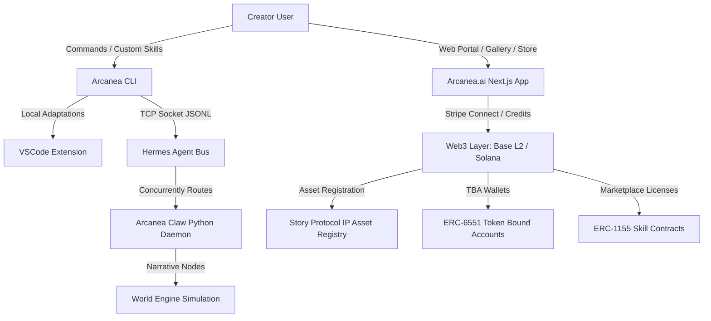

# Arcanea Master Production Roadmap & Product Blueprint

> **Date**: 2026-06-19  
> **Status**: Active Control Plane  
> **Target Audience**: Human Operators & Autonomous Swarm Agents (Luminor Fleet)  
> **Context**: SIS Creative Media & Engineering Substrate

---

## 1. Executive Summary: The Arcanea Ecosystem

Arcanea is a sovereign, **Bring Your Own Key (BYOK)-first creative intelligence workspace** designed to unify local-first agent engineering with cloud-scale collaboration, narrative simulation, and on-chain intellectual property (IP) provenance. 

By linking local runtime environments (via CLI, VSCode, and Python daemons) with a Next.js SaaS portal (`arcanea.ai`) and Web3 smart accounts (ERC-6551 + Story Protocol PIL), Arcanea provides the plumbing for the future of creator economies.



---

## 2. Product Portfolio Status & Production Backlog

Here is the status of every product in the Arcanea portfolio, detailing what is currently built and what needs to be advanced for production deployment:

### 1. Arcanea CLI (`packages/arcanea-cli`)
*   **Current State:** 
    *   Implements `list`, `search`, and `install` commands.
    *   Resolves local registry files (`oss/skills/registry.json`) with fallbacks to remote GitHub raw configurations.
    *   Auto-detects home folder paths of popular agent platforms (Claude Code, OpenCode, Cursor, Codex, Gemini CLI).
*   **Production Backlog:**
    *   [ ] Add `starlight horizon share` commands to sync local knowledge graphs to remote vectors.
    *   [ ] Implement signature signing helpers for Web3 actions directly in the terminal (via CLI-based keystore or browser loops).
    *   [ ] Build automated telemetry loops that report local model performance ratings.

### 2. Arcanea Code (VSCode Extension, `packages/vscode`)
*   **Current State:**
    *   Basic extension wrapper utilizing esbuild and typescript.
    *   Wires basic keyboard shortcuts and context selectors.
*   **Production Backlog:**
    *   [ ] Implement direct sidebar panel displaying the active **Luminor Agent status** (from the local orchestrator).
    *   [ ] Wire automatic workspace context injection: packages files, dependency maps, and `AGENTS.md` rules directly into the developer chat context.
    *   [ ] Package extension and publish to VS Code Marketplace.

### 3. Arcanea MCP (`packages/arcanea-mcp` & `packages/arcanea-registry-mcp`)
*   **Current State:**
    *   Standard Model Context Protocol servers updated from version `0.5.0` to `1.29.0`.
    *   Exports 34 specialized tools (e.g. `world_report`, `generate_conflict`, `weave_narrative`) via Zod schemas.
    *   Dual HTTP/SSE and Standard Input/Output transport layers implemented.
*   **Production Backlog:**
    *   [ ] Build dynamic MCP tool authentication: verifies developer credit balances on-chain before executing resource-heavy tools.
    *   [ ] Integrate local sqlite caching for high-frequency MCP calls (e.g., semantic search).

### 4. Arcanea Plugins (Custom Agent Modules)
*   **Current State:**
    *   Standard `.claude-plugin` and `.grok` hook bindings configured in repository root.
    *   Pre/post task hooks integrated in workspace customization.
*   **Production Backlog:**
    *   [ ] Standardize plugin manifest format (`clawhub.json`) for cross-compatible installation.
    *   [ ] Build verification scripts to lint third-party plugins for security (preventing arbitrary code execution or credential stealing).

### 5. Arcanea.ai (`apps/web` Next.js Application)
*   **Current State:**
    *   Highly polished, responsive Next.js 16 (Turbopack) UI.
    *   Wired Supabase Auth, profiles database, and creations gallery.
    *   **Creations Gallery Web3 integrations:** Displays Story Protocol IPAsset registration status, sponsored Base Sepolia transactions, and IPFS metadata hash links.
    *   **Claw Store Dashboard (`/studio/store`):** Multi-tab store UI with simulated Stripe checkouts, Stripe Connect developer payout splits (70/30), credit updates, and counterfactual ZeroDev Smart TBA generation.
*   **Production Backlog:**
    *   [ ] Replace mock ZeroDev/Safe contracts with live deployments on Base Sepolia and Base Mainnet.
    *   [ ] Wire live Stripe Connect API endpoints in `/api/stripe/payout` and webhook listeners to sync payment states with Supabase.
    *   [ ] Implement decentralized metadata uploads to IPFS (via Pinata or Web3.Storage) instead of mock string derivation.

### 6. Arcanea Skills (SKILL.md Spec)
*   **Current State:**
    *   YAML frontmatter parsing rules defined.
    *   Local adapters (`openclaw_adapter.ts`) translate between Claude Code and OpenClaw engine formats.
*   **Production Backlog:**
    *   [ ] Standardize visual-asset mapping within `SKILL.md` (e.g., matching p5.js scripts to p5 graphics in the browser).
    *   [ ] Implement a local compiler that compiles `SKILL.md` specifications directly into a JSON tool-definition schema for any LLM client.

### 7. Arcanea Swarms (Agent Coordination, `packages/swarm-coordinator`)
*   **Current State:**
    *   Supports basic blackboard swarm patterns.
*   **Production Backlog:**
    *   [ ] Implement hierarchical swarms (Research Architect -> scouts) as defined in `AGENTS.md`.
    *   [ ] Wire memory coordination loops that update the central Starlight context database in real-time.
    *   [ ] Connect AgentDB trajectory logging to allow post-hoc agent review and reinforcement learning loops.

### 8. Arcanea Orchestrator (Session Manager, `packages/orchestrator`)
*   **Current State:**
    *   Basic task queue and session execution framework.
*   **Production Backlog:**
    *   [ ] Implement 3-tier model routing (Haiku / Sonnet / Opus) dynamically based on token volume, budget constraints, and task complexity.
    *   [ ] Build priority task scheduling with worker thread balance checks.

### 9. Arcanea Publishing House (`packages/publishing-house`)
*   **Current State:**
    *   Writers' council configuration and content generators.
*   **Production Backlog:**
    *   [ ] Wire automatic on-chain licensing templates using Story Protocol PIL (Programmable IP License) terms.
    *   [ ] Implement epub / pdf compiler generators to export finished books and manuscripts.

### 10. Arcanea Claw (Python Engine Runtime, `arcanea-claw` repository)
*   **Current State:**
    *   Fast event-loop daemon that polls database events.
    *   Includes `hermes.py` connection client that hooks `emit_event` to publish events asynchronously over TCP port 8520.
*   **Production Backlog:**
    *   [ ] Package daemon as a standalone installer (`pip` or `uv` script).
    *   [ ] Optimize concurrent event executions using async python execution limits to prevent GPU/WSL2 out-of-memory crashes.

### 11. Arcanea Hermes Agent (TCP Message Bus Router, `packages/agent-bus`)
*   **Current State:**
    *   High-performance JSONL-over-TCP broker running on port 8520.
*   **Production Backlog:**
    *   [ ] Implement SSL/TLS encryption for cross-machine TCP routing (allowing local daemons to talk securely to cloud orchestrators).
    *   [ ] Add event replay buffers in case of connection dropouts.

### 12. Arcanea Flow (`packages/arcanea-flow`)
*   **Current State:**
    *   Basic visual nodes model.
*   **Production Backlog:**
    *   [ ] Wire Flow UI in Next.js using React Flow / XYFlow to display active agent swarm pipelines in real-time.
    *   [ ] Allow dragging/dropping custom skills to construct new orchestrator sessions visually.

### 13. Arcanea World Engine (`packages/world-engine`)
*   **Current State:**
    *   Lore and character database generators.
*   **Production Backlog:**
    *   [ ] Integrate narrative vector database to dynamically retrieve character consistency memory.
    *   [ ] Connect World Engine simulator outputs directly to the creations gallery.

### 14. Arcanea Starlight Intelligence System (SIS)
*   **Current State:**
    *   Local context bridge and state sync scripts.
*   **Production Backlog:**
    *   [ ] Build centralized vector memory server supporting dynamic schema updates.
    *   [ ] Implement secure context compaction algorithms to keep prompt windows clean.

---

## 3. Competitive Gaps & SOTA Rationale

| Competitor Type | Gap in Market | Arcanea SOTA Approach |
|:---|:---|:---|
| **SaaS AI Portals** (v0, ChatGPT, Claude.ai) | Locked silos. No local integration. You cannot use your own local code/daemons with their custom tools. No on-chain ownership of outputs. | **BYOK + Web3 Provenance:** Connects local runtime processes to a cloud storefront. Every creation is automatically registered on-chain with licensing metadata. |
| **On-Chain Agent Protocols** (Virtuals, Wayfinder) | Extremely high latency, high gas fees. Do not support local-first developer flows. Lack rich visual design systems. | **Counterfactual ERC-6551 TBAs + Paymaster Sponsorship:** Fast local execution. Web3 transactions are batched on Base L2, sponsored via Gelato/ZeroDev, making Web3 invisible to creators. |
| **Agent Frameworks** (LangChain, CrewAI) | Lack visual dashboards, monetizable skill registries, and standardized inter-agent messaging buses. | **Hermes Message Bus + Claw Store:** A standard TCP bus links TS/Python runtimes. Developers monetize skills as ERC-1155 tokens with automatic payout splits. |

---

## 4. Web3 and Credit Settlement Architecture

To ensure high speed, low friction, and legal robustness, the ecosystem uses a **hybrid off-chain/on-chain tokenomics model**:

### Stripe credit billing models & developer payout splits
*   **Credits System:** Standard SaaS credits database tracks execution consumption. Free users receive 20 daily credits. Subscription tiers ($19/mo, $49/mo) and Top-Up packages settle instantly off-chain.
*   **Creator Marketplace Splits:** Developers list skills on the Claw Store. Payouts are settled as a **70/30 split** (70% Developer, 30% Platform).
*   **Stripe Connect:** Settles fiat payments and creator balances. Creators link their bank accounts via Stripe Connect. Payouts can be requested instantly inside `/studio/store`.

### On-chain Smart Contracts (Base Sepolia L2 & Solana)
*   **Base Sepolia** is selected for complex on-chain registry states:
    1.  `AgentIdentityTBA.sol` — ERC-721 token factory deploying **ERC-6551 Token Bound Accounts (TBA)**. Every certified creator agent owns its wallet and its earned assets.
    2.  `StoryIPRegistry.sol` — Connects to **Story Protocol**. Registers characters, lore nodes, and gallery illustrations as IP Assets (IPAs) with Programmable IP License (PIL) terms.
    3.  `ClawSkillLicense.sol` — ERC-1155 skill license contract. Distributes payment shares: 70% Creator, 25% Node host, 5% Protocol fee.
*   **Solana** (Future Integration) will be used for high-velocity tipping, low-cost micro-credits transfers, and instant NFT minting to bypass EVM latency during live creations.

---

## 5. Governance: Core vs. Community

To maintain structural excellence while compounding creator contributions, responsibility is split:

```
               ┌──────────────────────────────────────────────────┐
               │              ARCANEA GOVERNANCE                  │
               └───────────────────────┬──────────────────────────┘
                                       │
            ┌──────────────────────────┴──────────────────────────┐
            ▼                                                     ▼
┌───────────────────────┐                             ┌───────────────────────┐
│     CORE OWNED        │                             │    COMMUNITY OWNED    │
│  (FrankX / Proprietary│                             │   (Open Source / OSS) │
├───────────────────────┤                             ├───────────────────────┤
│ • Next.js Portal App  │                             │ • CLI Registry Client │
│ • Stripe Billing Hub  │                             │ • VSCode Extension    │
│ • Swarm Orchestrator  │                             │ • Custom Skills Packs │
│ • Lore & World Engine │                             │ • Python Claw Daemon  │
│ • Base Smart Contracts│                             │ • Hermes Router Bus   │
└───────────────────────┘                             └───────────────────────┘
```

### Core Maintained (FrankX Labs / Proprietary)
*   **Role:** Custodian of visual design aesthetics (`DESIGN.md`, `@arcanea/design-system` v0.3.0), billing integrations, database hosting, and the central Next.js server.
*   **Value:** Guarantees brand continuity, system availability, Stripe settlements, and security monitoring.

### Community Maintained (Open Source / OSS)
*   **Role:** Writing custom skill templates (`SKILL.md`), building VSCode extensions, creating integration shims, and hosting node daemons.
*   **Value:** Creates a compounding repository of custom agent behaviors, unblocks new language models, and spreads node operations across decentralized compute resources.

---

## 6. Actionable Production Roadmap

```
Phase 1: Hardening (Weeks 1-3)     Phase 2: Closed Beta (Weeks 4-6)    Phase 3: Public Launch (Weeks 7-9)
┌──────────────────────────────┐   ┌──────────────────────────────┐   ┌──────────────────────────────┐
│ • Typecheck/Lint Hardening   │   │ • ZeroDev Smart Wallet Prod  │   │ • Mainnet Smart Contracts   │
│ • Local TCP Hermes Test suite│   │ • Stripe Connect API Links   │   │ • Publish VSCode Extension  │
│ • Supabase OAuth Configured  │   │ • Closed Beta Gallery Pinning│   │ • Developer SDK Release      │
└──────────────┬───────────────┘   └──────────────┬───────────────┘   └──────────────┬───────────────┘
               │                                  │                                  │
               ▼                                  ▼                                  ▼
          [MILESTONE 1]                      [MILESTONE 2]                      [MILESTONE 3]
```

### Phase 1: Hardening & local daemon synchronization
1.  **Actions:**
    *   Finalize Supabase OAuth client redirects in the live Supabase dashboard.
    *   Package `agent-bus` and `arcanea-cli` to compile with frozen dependencies.
    *   Write unified typescript test suite for `HermesRouter` port binds.
2.  **Verification:**
    *   `pnpm run verify:project-workspaces` must pass 100% cleanly in CI.

### Phase 2: Closed Beta (Stripe & Smart Wallet deployment)
1.  **Actions:**
    *   Deploy Base Sepolia smart contract contracts from hardhat/foundry scripts.
    *   Replace mock ZeroDev address derivation in `/studio/store` with live SDK setup.
    *   Wire Stripe Connect onboarding links and test transactions.
2.  **Verification:**
    *   E2E playwright test checking: User Auth -> Wallet Generation -> Skill License purchase -> Stripe simulation -> IPA Registration.

### Phase 3: Public Launch & Mainnet Deployment
1.  **Actions:**
    *   Deploy smart contracts to Base Mainnet.
    *   Publish `arcanea` package to npm public registry.
    *   Publish VSCode extension to Microsoft Marketplace.
2.  **Verification:**
    *   Production performance audits (LCP under 1.2s, WCAG 2.2 AA compliant, zero console errors).

---

## 7. Quality Assurance & Testing Guidelines

### Automated Testing Matrix
*   **Smart Contracts:** Foundry unit tests (`forge test`) checking license payouts, splits math, and TBA ownership.
*   **Local TS/JS Packages:** Vitest unit tests in `packages/arcanea-cli` and `packages/agent-bus`.
*   **Python Claw Daemon:** Pytest tests verifying TCP packet parsing and DB fallback writes.
*   **Next.js Dashboard:** Playwright E2E tests checking authentication, store purchases, and creations display.

### Manual Quality Gates
*   **TASTE.md Audit:** All UI surfaces must be validated against visual aesthetics (Instrument Serif typography accents, custom cosmic-void HSL palettes).
*   **Luminor Design Council:** Swarm outputs must pass the machine-readable design tokens registry verification before publishing.
